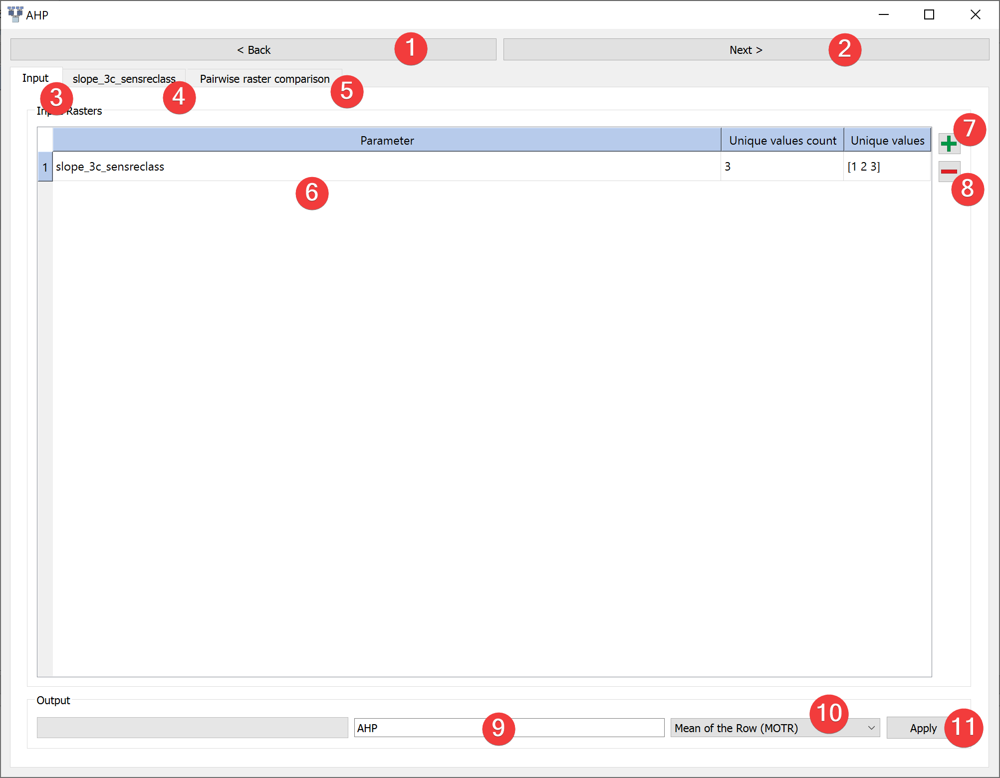
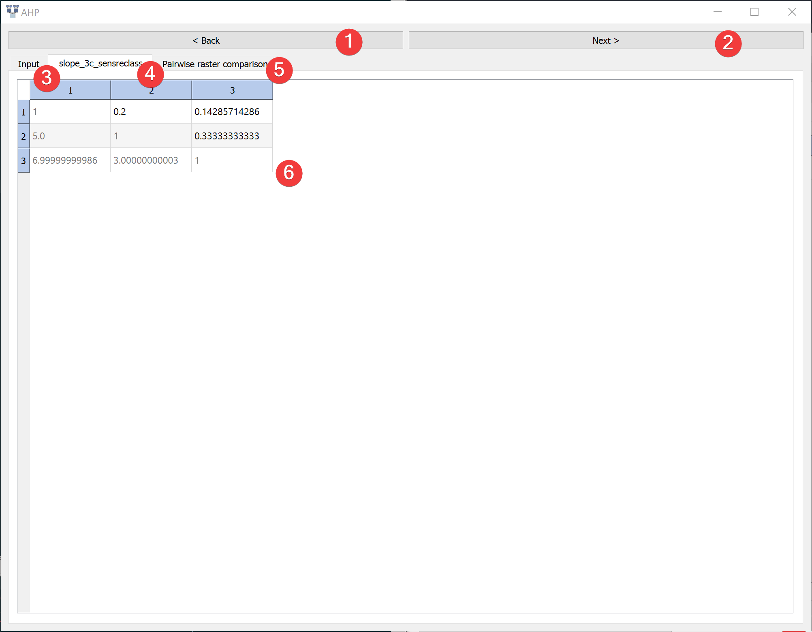
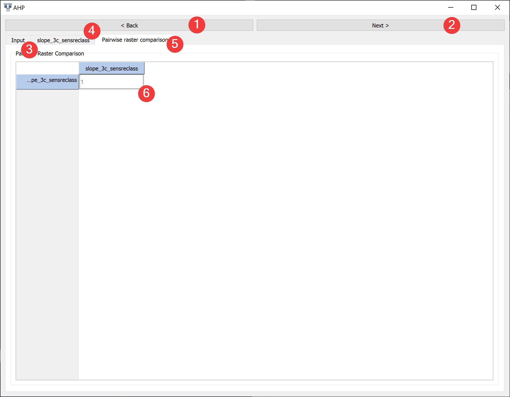

.. ahp:

Analytic Hierarchy Process (AHP)
--------------------------------

   AHP Widget - input tab

Run Analytic Hierarchy Process (AHP) analysis.

Usage
^^^^^

#. Add rasters to the calculation with a dialog (7)
#. Provide an name for the output files (9)
#. Select a method to derive the priority vector (10)
#. Move to the raster value comparison tab (4) or click next (2).

Remove raster datasets from the calculation by clicking (8)

Raster tabs (4):

   AHP Widget - raster tab

#. Assign a :ref:`rating<preftable>` to each pairwise raster value comparison (6)
#. Continue to the pairwise raster comparison tab (5)

Pairwise raster comparison tab (5):

   AHP - pairwise raster comparison tab

#. Assign a :ref:`rating<preftable>` to each pairwise raster comparison (6)
#. Return to the input tab and click Apply (11)

After the calculation finished you can view the :doc:`results</PROJECT/View/ResultsAHP>` (2) by 
right clicking the output .npz in the :doc:`catalog</PROJECT/View/Catalog>`.

Information
^^^^^^^^^^^

.. _preftable:

Scale of preference (Saaty, 1977)

+---------------------------+---------------------------------+-----------------------------------+
| Intensitity of importance | Definition                      | Explanation                       |
+---------------------------+---------------------------------+-----------------------------------+
| 1                         | Equal importance                | Two activities contribute equally |
|                           |                                 | to the objective                  |
+---------------------------+---------------------------------+-----------------------------------+
| 3                         | Weak importance of over another | Experience and judgment slightly  |
|                           |                                 | favor one over another            |
+---------------------------+---------------------------------+-----------------------------------+
| 5                         | Essential or strong importance  | Experience and judgment strongly  |
|                           |                                 | favor one over another            |
+---------------------------+---------------------------------+-----------------------------------+
| 7                         | Demonstrated importance         | One is strongly favored and its   |
|                           |                                 | dominance is demonstrated in      |
|                           |                                 | practice                          |
+---------------------------+---------------------------------+-----------------------------------+
| 9                         | Absolute importance             | The evidence favoring one over    |
|                           |                                 | another is of the highest         |
|                           |                                 | possible order of affirmation     |
+---------------------------+---------------------------------+-----------------------------------+
| 2, 4, 6, 8                | Intermediate values             | Compromises                       |
+---------------------------+---------------------------------+-----------------------------------+
| Reciprocals               | Inverse comparison              | Inverse comparison                |
+---------------------------+---------------------------------+-----------------------------------+

You can write number < 1 as fractions in the pairwise comparison table, e.g. "1/7" get converted 
to 0.14285714286.

LSAT supports AHP for raster datasets with up to 10 values. If you have a continous raster or a 
raster dataset with more unique values reclassify them first with
the :doc:`Sensitivity Reclassification Widget</DATA/RasterTools/SensReclass>` or 
:doc:`Reclassify Widget</DATA/RasterTools/Reclassify>`.

Input and Output
^^^^^^^^^^^^^^^^
+------------+---------------------------------------------------------------+
|  Input     | Raster dataset(s) (.tif)                                      |
+------------+---------------------------------------------------------------+
|            | AHP model raster dataset (.tif)                               |
|            |                                                               |
|            | Output path: /results/AHP/rasters/\*output name\*.tif         |
|            |                                                               |
+     Output +                                                               +
|            | AHP model information (.npz)                                  |
|            |                                                               |
|            | Output path: /results/AHP/tables/\*output name\*_tab.npz      |
+------------+---------------------------------------------------------------+ 