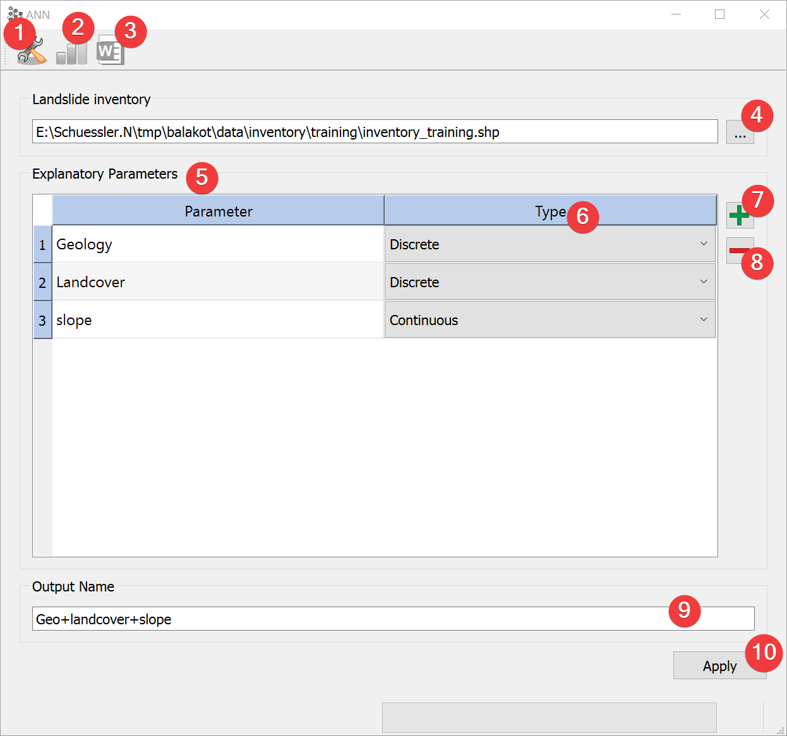
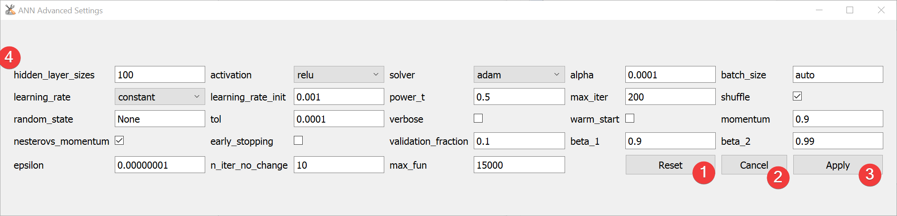

.. ann:

Artificial Neural Network (ANN)
-------------------------------

   ANN Widget

Run Artificial Neural Network (ANN) analysis.

Usage
^^^^^

#. | Add a vector file with the landslide inventory. You can either type the absolute path to the 
   | file or select it from your PC with a dialog (4).
#. Add (7) raster datasets to the explanatory parameters (5)
#. Set the type (6) of each parameter using the combobox
#. (Optional) Adjust the calculation settings in the :ref:`advanced settings<annadvanced>` (1)
#. Provide an output name (9)
#. Start the calculation (10)

Remove raster datasets from the calculation by clicking (8).

After the calculation finished you can view the :doc:`results</PROJECT/View/ResultsANN>` (2).

Support for automatically writing a report (3) is coming soon.

.. _annadvanced:

Advanced Settings
^^^^^^^^^^^^^^^^^

   ANN Advanced Settings Widget

To learn more about the individual parameters (4) see 
`scikit-learns MLPClassifier documentation <https://scikit-learn.org/stable/modules/generated/sklearn.neural_network.MLPClassifier.html>`_

After changing the values you can reset (1) them to default values or apply (3) them.

Close and cancel (2) at any time without making changes to the Settings.

Edit the defaults by changing [DEFAULT] in \*LSAT Folder\*/core/widgets/ANN/ann_config.ini. 

Information
^^^^^^^^^^^

LSAT PM uses `scikit-learns MLPClassifier <https://scikit-learn.org/stable/modules/generated/sklearn.neural_network.MLPClassifier.html>`_
to apply ANN to spatial data.

Changes made to the settings are persistent.

Input and Output
^^^^^^^^^^^^^^^^
+------------+---------------------------------------------------------------+
|            | Raster dataset(s) (.tif)                                      |
+     Input  +                                                               +
|            | Feature dataset (Vector file)                                 |
+------------+---------------------------------------------------------------+
|            | ANN model raster dataset (.tif)                               |
|            |                                                               |
|            | Output path: /results/ANN/rasters/\*output name\*_ann.tif     |
|            |                                                               |
+     Output +                                                               +
|            | ANN model information (.npz)                                  |
|            |                                                               |
|            | Output path: /results/ANN/tables/\*output name\*_tab.npz      |
+------------+---------------------------------------------------------------+ 
