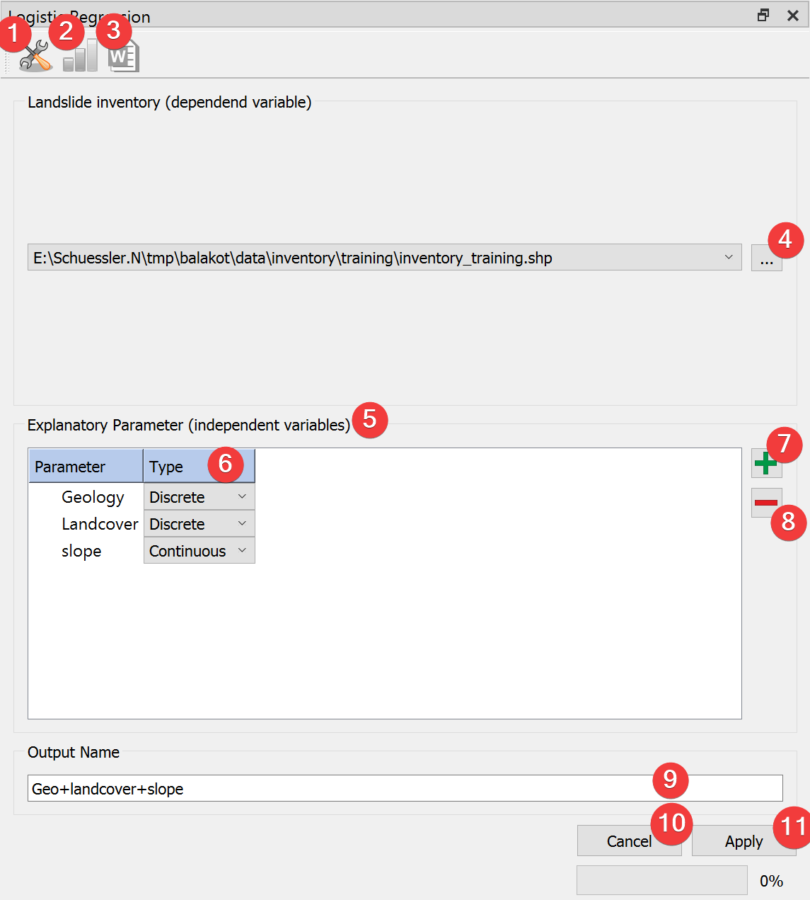
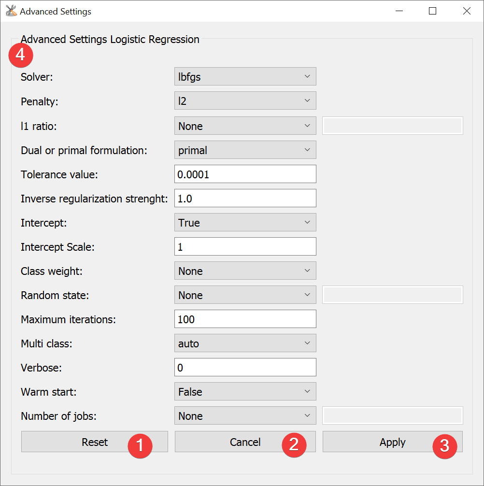

.. lr:

Logistic Regression (LR)
------------------------

   LR Widget

Run Logistic Regression (LR) analysis.

Usage
^^^^^

#. | Add a vector file with the landslide inventory. You can pick one from the project with the
   | combobox or select it from your PC with a dialog (4).
#. Add (7) raster datasets to the explenatory parameters (5)
#. Set the type (6) of each parameter using the combobox
#. (Optional) Adjust the calculation settings in the :ref:`advanced settings<lradvanced>` (1)
#. Provide an output name (9)
#. Start the calculation (11)

Remove raster datasets from the calculation by clicking (8).

After the calculation finished you can view the :doc:`results</PROJECT/View/ResultsLR>` (2).

Support for automatically writing a report (3) is coming soon.

.. _lradvanced:

Advanced Settings
^^^^^^^^^^^^^^^^^

   LR Advanced Settings Widget

To learn more about the individual parameters (4) see 
`scikit-learns LogisticRegression documentation <https://scikit-learn.org/stable/modules/generated/sklearn.linear_model.LogisticRegression.html>`_.
For a brief overview hover your mouse cursor over the parameters name.

After changing the values you can reset (1) them to defaults or apply (3) them.

Close and cancel (2) at any time without making changes to the settings.

Edit the defaults by changing [DEFAULT] in
\*LSAT Folder\*/core/widgets/LogisticRegression/configLogReg.ini.

Information
^^^^^^^^^^^

LSAT PM uses `scikit-learns LogisticRegression <https://scikit-learn.org/stable/modules/generated/sklearn.linear_model.LogisticRegression.html>`_
to apply LR to spatial data.

Changes made to the settings are persistant.

Input and Output
^^^^^^^^^^^^^^^^
+------------+---------------------------------------------------------------+
|            | Raster dataset(s) (.tif)                                      |
+     Input  +                                                               +
|            | Feature dataset (Vector file)                                 |
+------------+---------------------------------------------------------------+
|            | LR model raster dataset (.tif)                                |
|            |                                                               |
|            | Output path: /results/LR/rasters/\*output name\*_lr.tif       |
|            |                                                               |
+     Output +                                                               +
|            | LR model information (.npz)                                   |
|            |                                                               |
|            | Output path: /results/LR/tables/\*output name\*_tab.npz       |
+------------+---------------------------------------------------------------+ 
