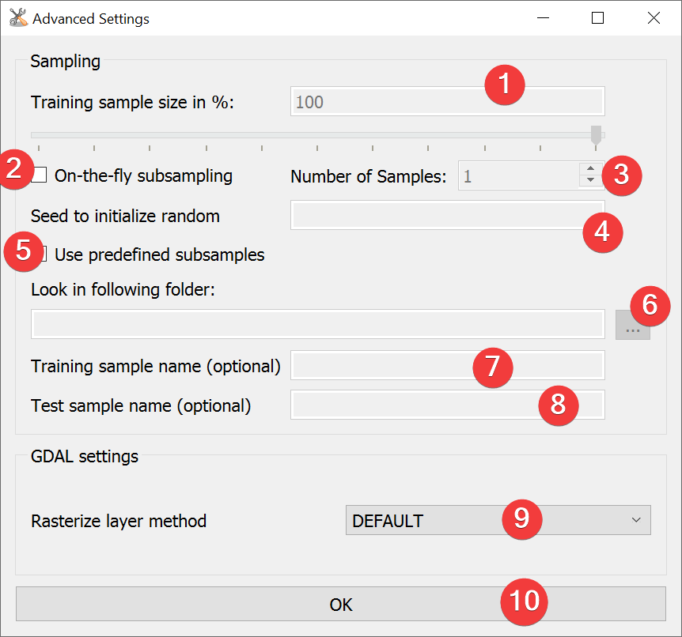

.. wofe:

Weight of Evidence (WofE)
-------------------------

   WofE Widget

Run Weights of Evidence (WofE) analysis.

Usage
^^^^^

#. | Add a vector file with the landslide inventory. You can pick one from the project with the
   | combobox or select it from your PC with a dialog (5).
#. Add (7) raster datasets to the datasets to analyze (6)
#. (Optional) Adjust the calculation settings in the :ref:`advanced settings<woeadvanced>` (1)
#. (Optional) Add an appendix to the output name by checking (9) and typing it in
#. Start the calculation (10)

After the calculation finished select a dataset (6) to view the
:doc:`results</PROJECT/View/ResultsWofE>` (3).

.. _woeadvanced:

Advanced Settings
^^^^^^^^^^^^^^^^^

   WofE Advanced Settings Widget

Weight of Evidence uses the same Advanced Settings as
:doc:`Model Builder</ANALYSIS/ModelManagment/ModelBuilder>`.

#. | Choose between On-the-fly subsampling (2), predefined subsamples (5) or select neither to use
   | single sample mode
   
    * On-the-fly subsampling (2)
    
        #. | Set the size of the subsamples as percent of the import feature either by typing a 
           | number (1) or adjusting the slider.
        #. Set the number of samples to generate on-the-fly (3)
        #. (Optional) Define a seed to initialize the random function (4)
        
    * Predefined subsamples (5)
    
        #. | Provide a path to the folder with the predefined subsamples. You can either type in
           | the absolute path yourself or pick one with a dialog (6).
           
    * Single sample mode (neither (2) nor (5) selected)
    
        #. By selecting neither (2) or (5) LSAT will use 100% of the feature.
        
#. (Optional) Change the rasterization method (9)
#. Select OK (10)

Information
^^^^^^^^^^^

The output raster dataset (.tif) contains the calculated Weights.

Only discrete raster datasets are suitable to analyze with WofE. If you have a continuous raster 
reclassify them first with the 
:doc:`Sensitivity Reclassification Widget</DATA/RasterTools/SensReclass>` or 
:doc:`Reclassify Widget</DATA/RasterTools/Reclassify>`.

Input and Output
^^^^^^^^^^^^^^^^
+------------+-------------------------------------------------------------------------------+
|            | Raster dataset(s) (.tif)                                                      |
+     Input  +                                                                               +
|            | Feature dataset (Vector file)                                                 |
+------------+-------------------------------------------------------------------------------+
|            | WofE model raster dataset (.tif)                                              |
|            |                                                                               |
|            | Output path: /results/WoE/rasters/\*output name\*\*appendix (if any)\*_woe.tif|
|            |                                                                               |
+     Output +                                                                               +
|            | WofE model information (.npz)                                                 |
|            |                                                                               |
|            | Output path: /results/WoE/tables/\*output name\*\*appendix (if any)\*_tab.npz |
+------------+-------------------------------------------------------------------------------+ 
