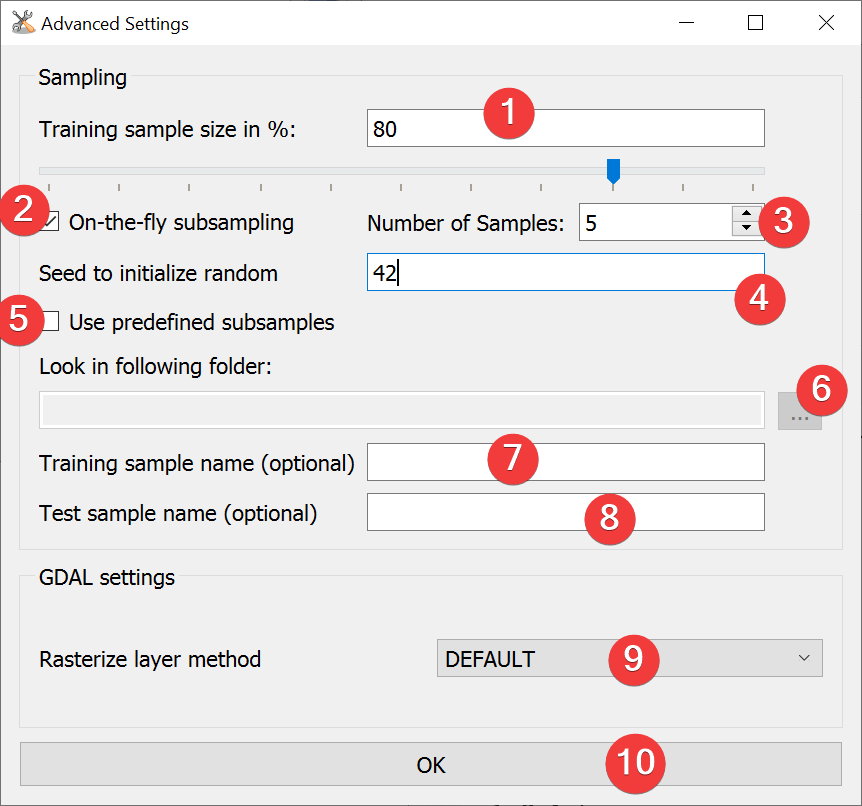

.. _modelbuilder:

Model Builder
-------------

   Model Builder Widget

Create models with the results of the analyses.

Usage
^^^^^

#. | Pick a feature dataset to use for model creation. You can either choose from the projects 
   | features or select one from your PC (1).
#. (Optional) Adjust the :ref:`advanced settings<mbadvancedsettings>` (18)
#. (Optional) Add datasets from outside your project (2) to the available ones (4)
#. | Select the datasets (4) you want to for the model and add them to the model layers (8). You 
   | can either right click on them or select them and click (5).
#. Name the model (3)
#. (Optional) Adjust the :ref:`Expression<expressionbuilder>` (10)
#. Create the model (11)

To move a dataset from the model datasets (8) to the list of available datasets you can either 
right click it or select it and click (6).

To remove a dataset from the list of available datasets (4) select it and press (7).

After LSAT finished creating the model it appear in the list of models (16). Select it to: 

* Export the model as an raster (12)
* View detailed :doc:`model information</PROJECT/View/ModelInfo>` (13)
* Delete the model (14)
* Open the model in the :doc:`Zoning Widget</ANALYSIS/ModelManagment/Zoning>` (15)

The receiver operating characteristics (ROC) Curve is displayed in (17).
If you generated a model using multiple samples a range will indicate the minimum and maximum ROC 
curves.

.. _mbadvancedsettings:

Advanced Settings
^^^^^^^^^^^^^^^^^

   Model Builder Advanced Settings

Model Builder uses the same Advanced Settings as
:doc:`Weights of Evidence</ANALYSIS/Analysis/WofE>`.

#. | Choose between On-the-fly subsampling (2), predefined subsamples (3) or select neither to use 
   | single sample mode
   
    * On-the-fly subsampling (2)
    
        #. | Set the size of the subsamples as percent of the import feature either by typing a 
           | number (1) or adjusting the slider.
        #. Set the number of samples to generate on-the-fly
        
    * Predefined subsamples (3)
    
        #. | Provide a path to the folder with the predefined subsamples. You can either type in
           | the absolute path yourself or pick one with a dialog (5).
           
    * Single sample mode (neither (2) nor (3) selected)
    
        #. By selecting neither (2) or (3) LSAT will use 100% of the feature.
        
#. (Optional) Change the rasterization method (8)
#. Select OK (9)

.. _expressionbuilder:

Expression Builder
^^^^^^^^^^^^^^^^^^

   Model Builder Expression Builder

With the expression builder you can modify and weigh input parameters. And so convert the normally
entirely data-driven models into hybrid models.

The default expression (4) does not modify the output in any way.

You can write any expression (4). Double click on input datasets (1) and example operators (3) to 
add them at the cursor location in (4). You switch between example numpy operators using (2).

.. warning::
    The expressions will be executed using
    `eval() <https://docs.python.org/3.7/library/functions.html#eval>`_. While this is a powerful 
    tool it can also break LSAT. Layer names must be legal python variable names.

Input and Output
^^^^^^^^^^^^^^^^
+------------+----------------------------------------------------------------+
|  Input     | Vector dataset (features)                                      |
|            +                                                                +
|            | Analysis results                                               |
+------------+----------------------------------------------------------------+
|  Output    | Model (.npz)                                                   |
|            |                                                                |
|            | Default path: /results/susceptibility_maps/\*name\*.npz        |
|            +                                                                +
|            | (Optional) Model Raster (.tif)                                 |
|            |                                                                |
|            | Default path: /results/susceptibility_maps/\*name\*.tif        |
+------------+----------------------------------------------------------------+
