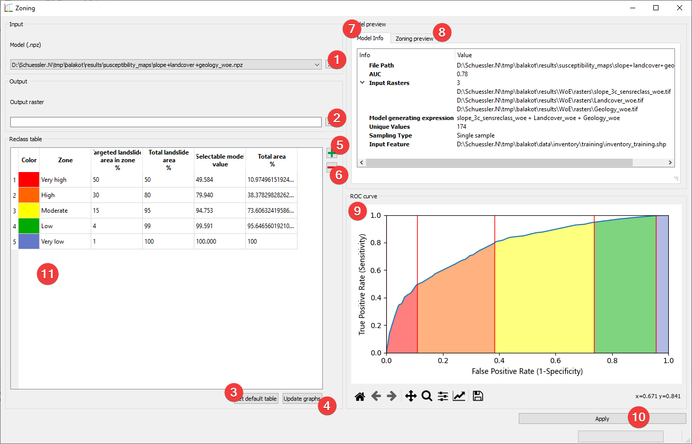

Zoning
------

   Zoning widget

Convert your models into landslide susceptibility maps.

Usage
^^^^^

#. Pick the input model with a dialog (1)
#. | Pick the output map location. You can either type in the absolute file path yourself 
   | or pick one with a dialog (2).
#. Define the landslide susceptibility zones (2 Alternatives):
    #. Set default table (3)
    #. Define the zone boundaries yourself:
        #. Add (5) and delete (6) zones as needed
        #. Name the zones in the reclass table (11)
        #. Set the "Targeted landslide area in zone %" for each zone except the last
#. Update the graphs (4)
#. Apply (10)

The model info (7) shows an embedded version of the
:doc:`Model Info Widget</PROJECT/View/ModelInfo>`

Zoning preview (8) and the ROC curve (9) offer a sneak peek at the resulting map.

If you started Zoning from the :doc:`Model Builder Widget</ANALYSIS/ModelManagment/ModelBuilder>` 
the selected Model will be available to you right away.

Input and Output
^^^^^^^^^^^^^^^^
+------------+----------------------------------------------------------------+
|  Input     | Model (.npz)                                                   |
+------------+----------------------------------------------------------------+
|  Output    | Landslide susceptibility map (.tif)                            |
|            |                                                                |
|            | Default path: /results/susceptibility_maps/\*name\*.tif        |
+------------+----------------------------------------------------------------+
