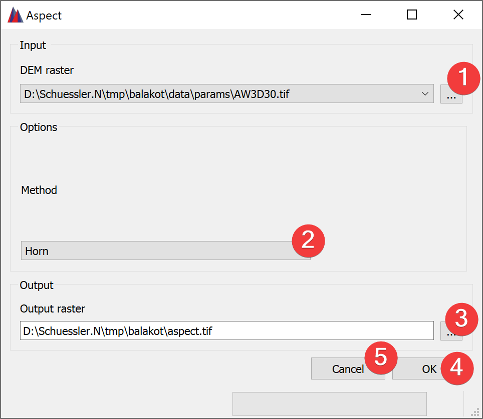

.. _aspect:

Aspect
------

   Aspect Widget

The aspect widget creates a new raster based on the calculated aspect from an input DEM raster.

Usage
^^^^^

#. | Select the input DEM raster. You can either select from imported rasters using the Input
   | combo box or select one from your PC (1).
#. Select the Method to calculate the aspect (2).
#. | Select the output aspect raster location. You can either type in the absolute file path
   | yourself or pick one with a dialog (3).
#. Start the calculation (4)

If you want to use the created aspect raster in your LSAT Project you need to import it using the
:doc:`Import Raster Widget</DATA/Import/ImportRaster>`.

Clicking on Cancel (5) closes the widget.

Input and Output
^^^^^^^^^^^^^^^^
+------------+---------------------------------------------------------------+
|  Input     | Digital Elevation Model raster dataset (.tif)                 |
+------------+---------------------------------------------------------------+
|  Output    | Aspect raster dataset (.tif)                                  |
+------------+---------------------------------------------------------------+ 