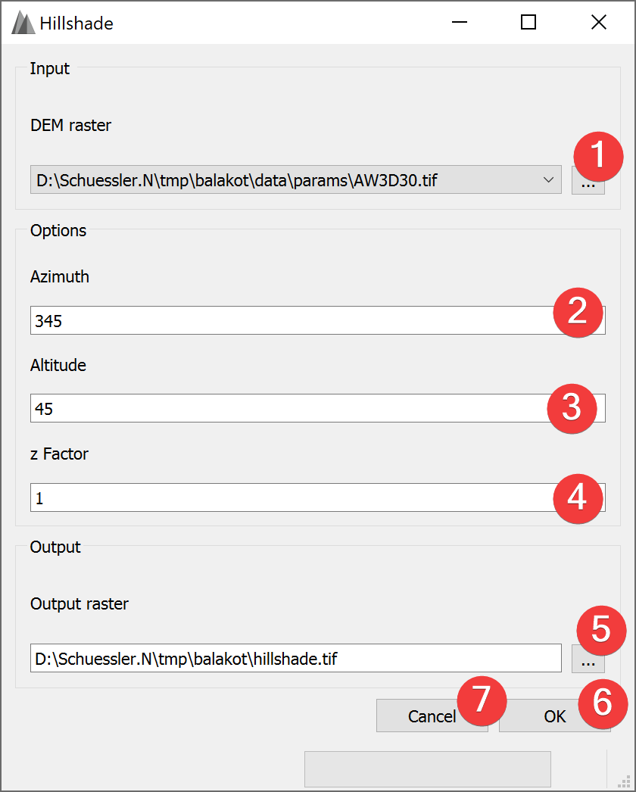

.. _hillshade:

Hillshade
---------

   Hillshade Widget

The hillshade widget creates a new raster based on the calculated hillshade from an input DEM
raster.

Usage
^^^^^

#. | Select the input DEM raster. You can either select from imported rasters using the Input
   | combo box or select one from your PC (1).
#. Select the Azimuth (2) (Default: 345).
#. Select the Altitude (3) (Default: 45).
#. Select the z Factor (4) (Default: 1).
#. | Select the output hillshade raster location. You can either type in the absolute file path
   | yourself or pick one with a dialog (5).
#. Start the calculation (6)

If you want to use the created hillshade raster in your LSAT Project you need to import it using the
:doc:`Import Raster Widget</DATA/Import/ImportRaster>`.

Azimuth defines the location the light is shining from in degrees (0-360).

Altitude defines the altitude the light is shining from in degrees (0-90).

z factor exaggerates the DEMs height.

Clicking on Cancel (7) closes the widget.

Input and Output
^^^^^^^^^^^^^^^^
+------------+---------------------------------------------------------------+
|  Input     | Digital Elevation Model raster dataset (.tif)                 |
+------------+---------------------------------------------------------------+
|  Output    | Hillshade raster dataset (.tif)                               |
+------------+---------------------------------------------------------------+ 