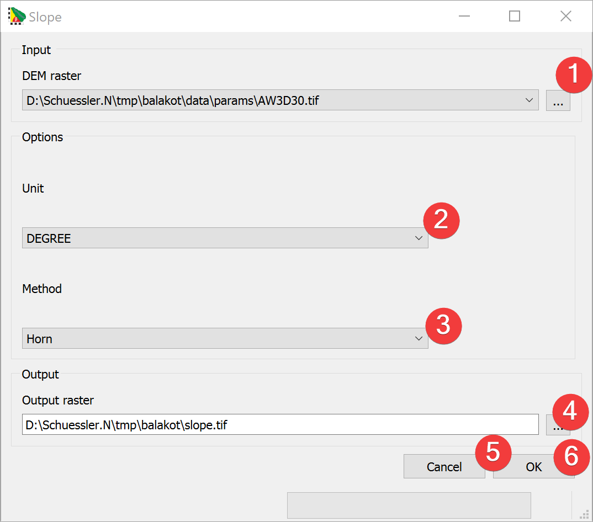

.. _slope:

Slope
-----

   Slope Widget

The slope widget creates a new raster based on the calculated slope from an input DEM raster.

Usage
^^^^^

#. | Select the input DEM raster. You can either select from imported rasters using the Input
   | combo box or select one from your PC (1).
#. Select the Output Unit (2).
#. Select the Method to calculate the slope (3)
#. | Select the output slope raster location. You can either type in the absolute file path
   | yourself or pick one with a dialog (4)
#. Start the calculation (6)

If you want to use the created slope raster in your LSAT Project you need to import it using the
:doc:`Import Raster Widget</DATA/Import/ImportRaster>`.

Clicking on Cancel (5) closes the widget.

Input and Output
^^^^^^^^^^^^^^^^
+------------+---------------------------------------------------------------+
|  Input     | Digital Elevation Model raster dataset (.tif)                 |
+------------+---------------------------------------------------------------+
|  Output    | Slope raster dataset (.tif)                                   |
+------------+---------------------------------------------------------------+ 