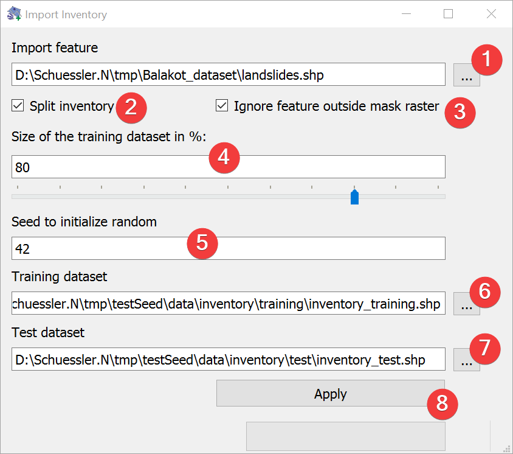

.. _importinventory:

Import Inventory
----------------

   Inventory Import Widget

Import Inventory (vector) files into LSAT Projects.

Usage
^^^^^

#. | Pick a vector dataset to import. You can either type the absolute path to the file or select 
   | it from your PC (1).
#. (Optional) Disable splitting the inventory into training and validation datasets.
#. (Optional) Disable ignoring feature parts outside the mask raster.
#. | Adjust the size of the training dataset as percent of the import feature either by typing a 
   | number (4) or adjusting the slider.
#. (Optional) Define a seed to initialize the random function (5).
#. | (Optional) Adjust the training dataset output location either by typing the output path or 
   | with a dialog (6)
#. | (Optional) Adjust the test dataset output location either by typing the output path or with a 
   | dialog (7)
#. Start the Import (8)

LSAT :doc:`clips</DATA/VectorTools/GeoprocessingTools>` the feature with region.shp of the current
project on the fly if you choose to ignore features outside the mask.

By defining a seed to initialize random (5) you can recreate the inventory split on a later date.

To achieve the best results in later :doc:`analyses</ANALYSIS/ANALYSIS>` consider splitting the 
inventory.

Most LSAT widgets expect the inventory to be in their default locations. While you can always 
point to another folder or file it is easier to leave the default output locations.

.. topic:: Why subsample?

    When we subset the inventory at the beginning of the modeling in training and test dataset, we 
    do a sampling, which is always associated with a sampling error. The sampling error increases 
    with the decreasing sample size. Thus, if we use 80% of the observations to train the model 
    and 20% to test the model, we generally have two samples that exhibit different sample errors. 
    Just imagine that a generated model has a performance with the training dataset indicated by 
    AUC index of 0.84. Evaluating the model with the test dataset showed an AUC index of 0.79. Is 
    this an indication of a poor generalization or is this value still in the possible range of 
    the model’s uncertainty? This question can be answered generating a set of samples, which have 
    the size of the test dataset. For example, if our test dataset has 20 observations, we would 
    randomly draw several samples of this size from our training dataset and compute the ROC 
    curve. Based on this subsampling, we would get a range of AUC values that would suggest to us 
    the possible variance of the model given the specific sample size and specific pattern 
    distribution. If the ROC curve of the test dataset falls within this range, we could assume 
    that the sampling error very likely governs the observed drop in the AUC index, and the model 
    generalizes for new events sufficiently well (in the range of its uncertainty). However, if
    the AUC index of the test dataset is clearly outside the estimated sample error range, we have 
    to assume that the model has a drop in the prediction quality due to other generalization 
    issues such as overfitting or maybe a consideration of correlated but non-causal factors 
    (pseudo-correlations).

Splitting process
^^^^^^^^^^^^^^^^^

LSAT only considers the total number of features when splitting the inventory into a training and 
test dataset.

Input and Output
^^^^^^^^^^^^^^^^
+------------+----------------------------------------------------------------+
|  Input     | Vector dataset                                                 |
+------------+----------------------------------------------------------------+
|  Output    | Training vector dataset                                        |
|            |                                                                |
|            | Default path: /data/inventory/training/inventory_training.*ext*|
|            +                                                                +
|            | (Optional) Test vector dataset                                 |
|            |                                                                |
|            | Default path: /data/inventory/test/inventory_test.*ext*        |
+------------+----------------------------------------------------------------+