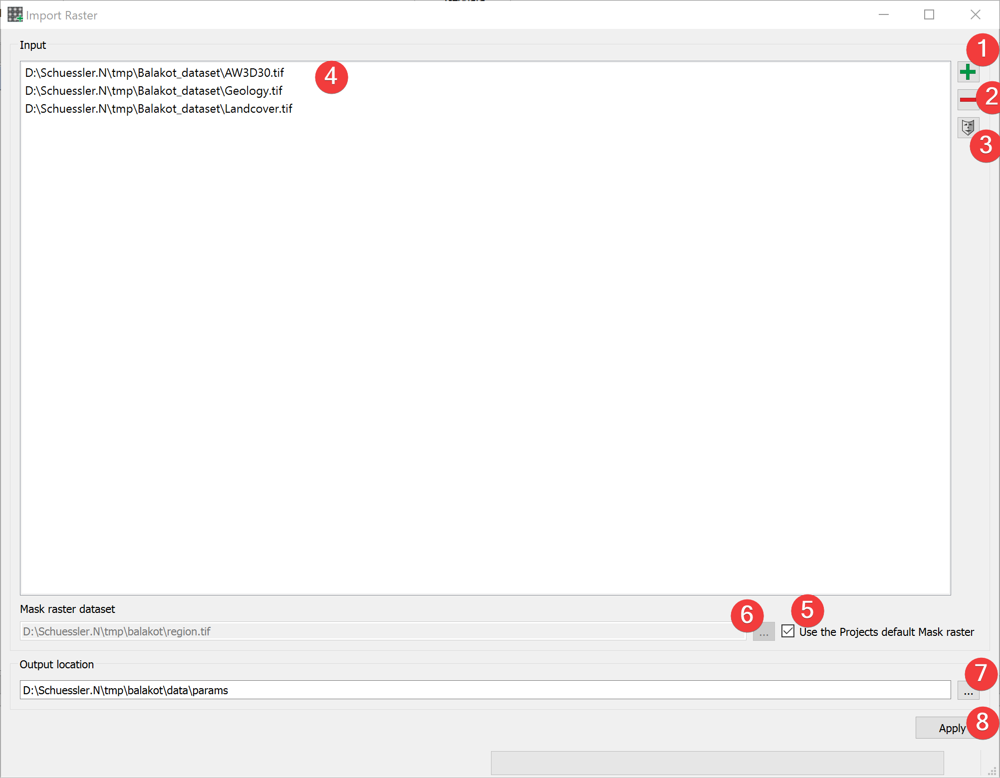
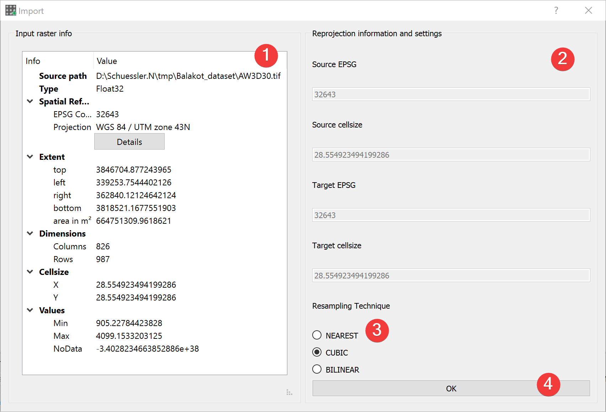
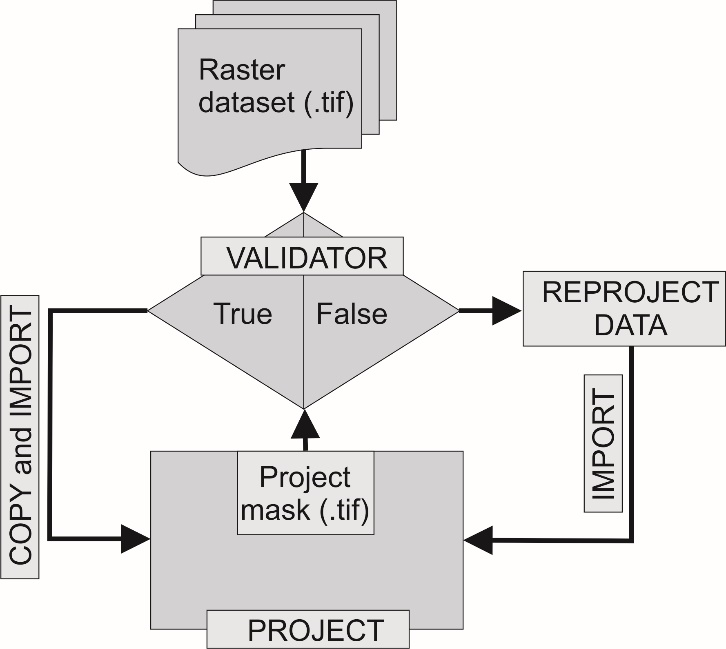

.. _importraster:

Import Raster
-------------

   Raster Import Widget

Import raster files into LSAT Projects.

Usage
^^^^^

#. | Add at least one raster dataset. You can either drag and drop the rasters from your 
   | file manager into the input list (4) or select them from your PC (1).
#. | (Optional) Change the mask raster dataset from the projects default by unchecking (5) and 
   | either picking an input raster by selecting it in the list (4) and clicking (3) or pick a 
   | mask from your PC (6).
#. | (Optional) Change the output location of the output files by either typing in an existing 
   | folder or picking one from your PC (7)
#. Start the import process (8) (the :ref:`import dialog<importdialog>` opens).

To remove a raster from inputs, select it and press the minus button (2).

To achieve the best results in later :doc:`analyses</ANALYSIS/ANALYSIS>` do not change the mask 
raster dataset.

.. _importdialog:

Import Dialog
^^^^^^^^^^^^^

   Raster Import Dialog

The raster import dialog opens from the :ref:`import raster widget<importraster>` and by importing 
the projects mask when :doc:`creating a new project</PROJECT/Project/NewProject>`

Usage

#. Pick a resampling technique (3) best suited for the type of raster you want to import (1).
#. Proceed with the import (4).

The input raster info (1) shows an embedded version of the 
:doc:`Raster Info Widget</PROJECT/View/RasterInfo>` for the import raster dataset.

You can compare basic information of the mask and import raster (2).

Resampling techniques:

    +------------+---------------------------------------------------------------+
    |            | Nearest-neighbor interpolation. Should be applied when        |
    | NEAREST    | transforming discrete data (e.g., classified raster datasets) |
    |            | such as lithology                                             |
    +------------+---------------------------------------------------------------+
    |            | Cubic spline interpolation. Should be used when projecting    |
    | CUBIC      | continuous datasets such as DEM.                              |
    +------------+---------------------------------------------------------------+
    | BILINEAR   | Alternative to Cubic spline interpolation when projecting     |
    |            | continuous datasets.                                          |
    +------------+---------------------------------------------------------------+

Import Process
^^^^^^^^^^^^^^

   Schematic workflow for raster dataset import

LSAT PM compares five properties of the input raster dataset to the mask raster dataset:

#. EPSG Code
#. Raster dimension (Number of rows/columns)
#. Raster origin
#. NoData count
#. NoData value

If all are the same the input raster dataset gets copied, else it gets reprojected.

If LSAT detects that the input raster is a discrete dataset it either copies an existing raster 
attribute table or creates a new one.

Input and Output
^^^^^^^^^^^^^^^^

+------------+---------------------------------------------------------------+
|  Input     | Raster datasets (.tif)                                        |
|            +                                                               +
|            | Mask raster (.tif) providing the spatial reference and the    |
|            | cell size. (Default: project mask)                            |
+------------+---------------------------------------------------------------+
|  Output    | Imported raster datasets  (.tif)                              |
|            | Path: /data/params/*name*.tif                                 |
+------------+---------------------------------------------------------------+