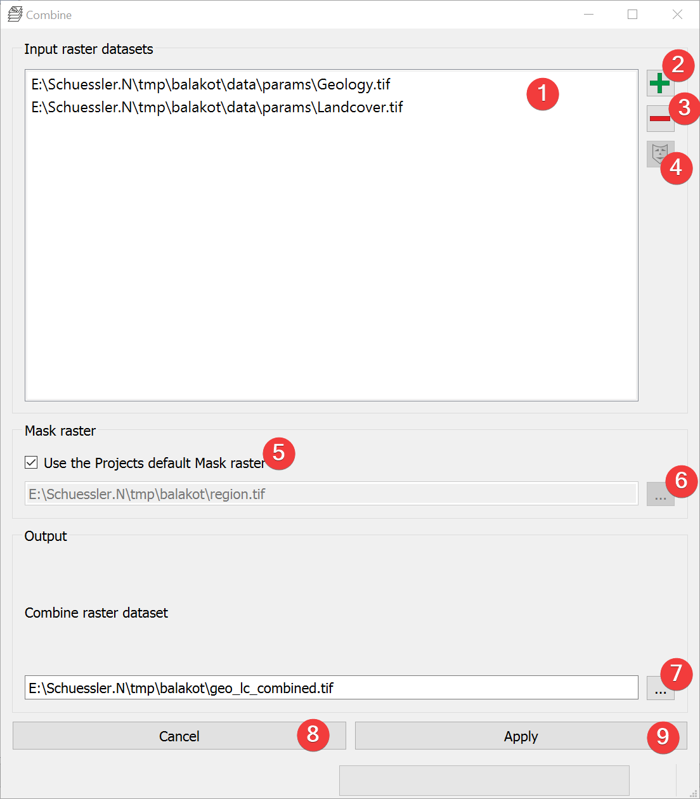

-- _combine:

Combine
-------

   Combine Widget

Creates a raster dataset based on unique combinations of input raster datasets.

Usage
^^^^^

#. | Add at least two raster datasets. You can either drag and drop the rasters from your 
   | file manager into the input list (1) or select them from your PC (2).
#. | (Optional) Change the mask raster dataset from the projects default by unchecking (5) and 
   | either picking an input raster by selecting it in the list (1) and clicking (4) or pick a 
   | mask from your PC (6).
#. | Select the combined raster output location. You can either type in the absolute file path
   | yourself or pick one with a dialog (7).
#. Start the calculation (9)

If you want to use the output raster in your LSAT Project you need to import it using the
:doc:`Import Raster Widget</DATA/Import/ImportRaster>`.

If any raster has noData the output raster will also have noData at that location.

Information
^^^^^^^^^^^

The input raster dataset values that lead to the output values are stored in the outputs Raster 
Attribute Table (RAT).

Input and Output
^^^^^^^^^^^^^^^^

+------------+---------------------------------------------------------------+
|  Input     | Input raster datasets (.tif)                                  |
|            +                                                               +
|            | Mask raster dataset (.tif)                                    |
+------------+---------------------------------------------------------------+
|  Output    | Combined raster dataset (.tif)                                |
+------------+---------------------------------------------------------------+