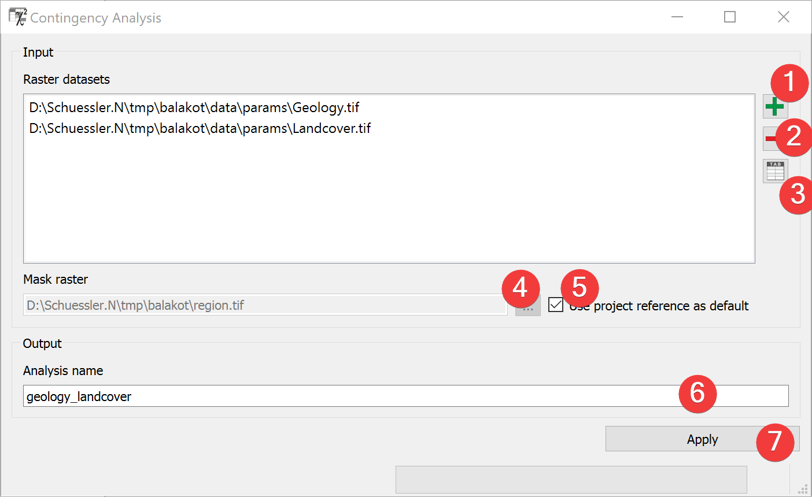
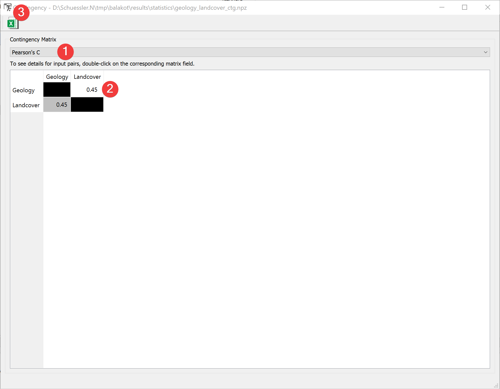
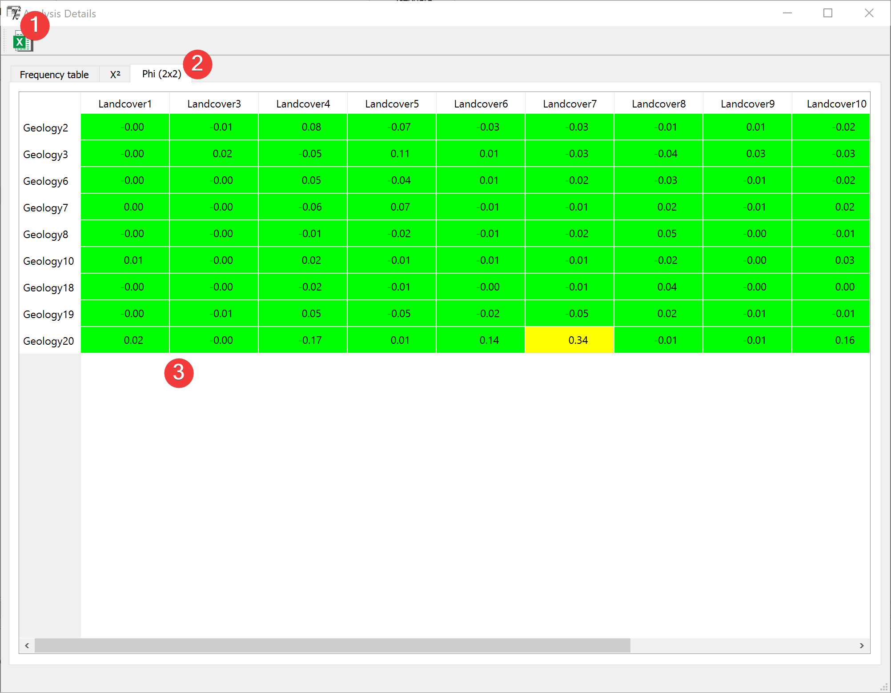

.. contingencyanalysis:

Contingency analysis
--------------------

   Contingency Analysis Widget 

The contingency analysis estimates association between categorized (discrete) raster datasets. The 
contingency analysis computes Pearson’s contingency coefficient C and Cramer’s V. 

Usage
^^^^^

#. | Add at least two discrete raster datasets. You can either drag and drop the rasters from your 
   | file manager or select them from your PC (1).
#. If necessary change the mask raster by unchecking (5) and selecting a new one (4).
#. Name the output file (6).
#. Start the Analysis (7).
#. | View the :ref:`results<contingencyresults>` by double-clicking on the output file in the 
   | :doc:`catalog</PROJECT/View/Catalog>`.

If you want to remove a raster from inputs, select it and press the minus button (2).

You can view the :doc:`Raster Attribute Table (RAT)</PROJECT/View/RAT>` of an Input raster 
by selecting it and pressing the RAT button (3).

Input and Output
^^^^^^^^^^^^^^^^

+------------+---------------------------------------------------------------+
|  Input     | Raster datasets (.tif) with limited discrete classes.         |
|            +                                                               +
|            | Mask raster (.tif) providing the spatial reference and the    |
|            | cell size. (Default: project mask)                            |
+------------+---------------------------------------------------------------+
|  Output    | Analysis file (.npz)                                          |
|            | Path: /results/statistics/\*output name\*_ctg.npz             |
+------------+---------------------------------------------------------------+  

.. _contingencyresults:

Results
^^^^^^^

   Contingency Analysis Results Widget 

This window shows the pairwise raster comparison.

Choose between displaying Pearson’s C or Cramer's V in the Table (2) with the combo box (1).

Clicking the button (3) opens a dialog to export the current Matrix in the Table (2) as an excel 
file.

Double-clicking a cell in the Table (2) opens the details for that comparison.

   Contingency Analysis Results Widget (details)

This window shows the pairwise raster value comparison.

Choose between displaying the frequency table, Chi-squared or Phi (2x2) in the Table (3) by 
selecting the corresponding tab (2).

Clicking the button (1) opens a dialog to export the current Matrix in the Table (3) as an excel 
file.