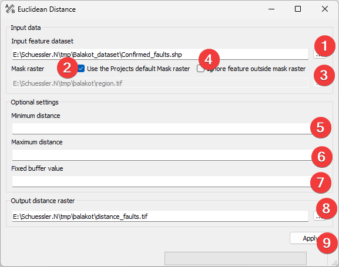

.. _euclideandistance:

Euclidean distance
------------------

   Euclidean Distance Widget

This widget estimates the closest Euclidean distance of a raster cell to the feature dataset.

Usage
^^^^^

#. | Select the input feature file. You can either type in the absolute file path or select it 
   | from your PC (1).
#. If necessary change the mask raster by unchecking (2) and selecting a new one (3).
#. (Optional) Choose to ignore (4) parts of the input feature that are not inside the mask.
#. (Optional) Set the maximum distance to calculate the distance (5).
#. (Optional) Set the value to write into cells within the distance (6).
#. | Select the output distance raster location. You can either type in the absolute file path
   | yourself or pick one with a dialog (7).
#. Start the calculation (8)

If the input feature dataset lies atleast partialy outside the mask and these parts are not 
ignored LSAT extents the output raster while keeping the mask raster cell size.

If you want to use the output raster in your LSAT Project you need to import it using the
:doc:`Import Raster Widget</DATA/Import/ImportRaster>`.

Input and Output
^^^^^^^^^^^^^^^^

+------------+---------------------------------------------------------------+
|  Input     | Feature dataset to calculate the distance from                |
|            +                                                               +
|            | Mask raster dataset (.tif)                                    |
+------------+---------------------------------------------------------------+
|  Output    | Euclidean distance raster dataset (.tif)                      |
+------------+---------------------------------------------------------------+
