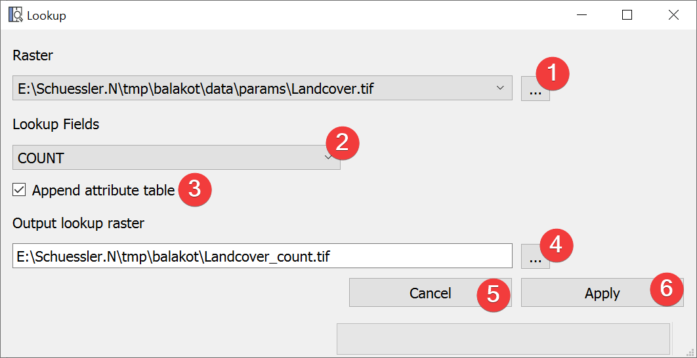

.. _lookup:
 
Lookup
--------

   Lookup Widget

Create a raster dataset based on values in the raster attribute table (RAT) of the input raster
dataset.

Usage
^^^^^

#. Select an input raster dataset with a dialog (1)
#. Select the RAT field (2) from which to create the new raster dataset 
#. | (Optional) Choose not to append the raster attribute table of the input raster (3)
#. | Select the lookup raster output location. You can either type in the absolute file path
   | yourself or pick one with a dialog (4).
#. Start the lookup (6)

If you want to use the output raster in your LSAT Project you need to import it using the
:doc:`Import Raster Widget</DATA/Import/ImportRaster>`.

Information
^^^^^^^^^^^

RAT values that are neither int nor float will not be displayed in the combobox (2) but will be 
appended if you choose to do so (3).

You can only lookup discrete rasters with a RAT.

Input and Output
^^^^^^^^^^^^^^^^

+------------+---------------------------------------------------------------+
|  Input     | Input raster dataset (.tif)                                   |
+------------+---------------------------------------------------------------+
|  Output    | Lookup raster dataset (.tif)                                  |
+------------+---------------------------------------------------------------+