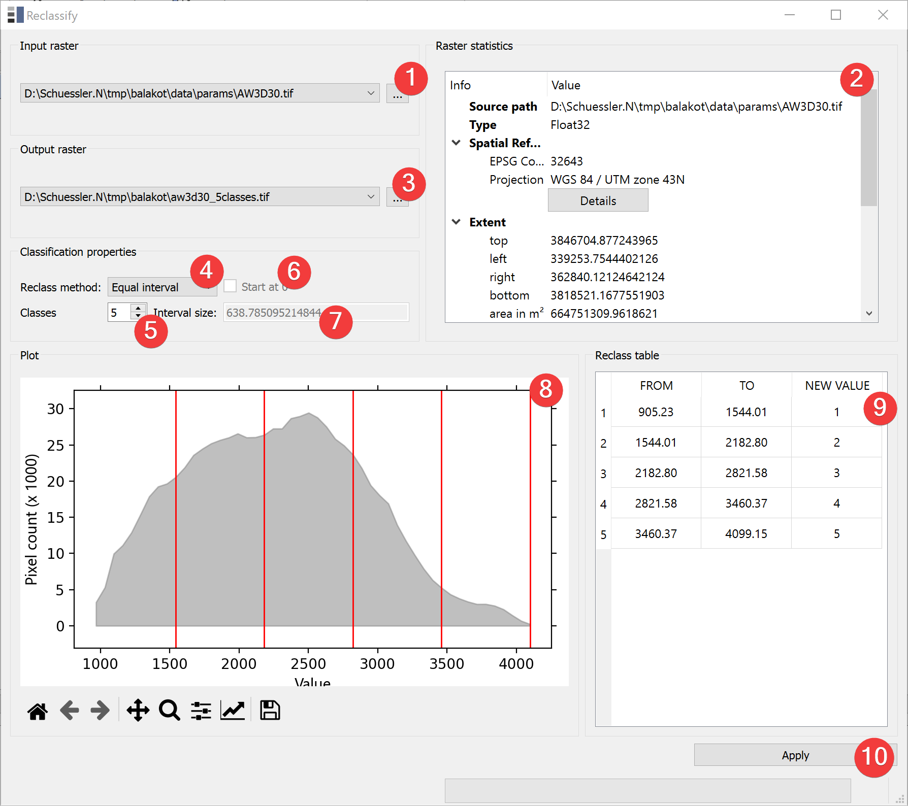

.. reclassify:

Reclassify
-----------

   Reclassify Widget 

The reclassify widget reclassifies raster datasets.

Usage
^^^^^

#. | Select the input raster. You can either select from imported rasters using the Input
   | combo box or select one from your PC (1).
#. | Select the output location of the reclassified raster. You can either type in the absolute 
   | file path yourself or pick one with a dialog (3).
#. Select a :ref:`reclass method<reclassificationmethods>` (4).
#. Set the related classification properties (5, 6, 7, 8).
#. Start the reclassification (10).

If you want to use the created reclassified raster in your LSAT Project you need to import it
using the :doc:`Import Raster Widget</DATA/Import/ImportRaster>`.

The Plot (8) and the reclass table (9) preview the output raster. The grey area in the Plot show 
the distribution of the input rasters values. The red lines indicate the boundaries of the new
values.

If the input raster is of type float it will be displayed as a grey area. If it is an integer 
raster there will be bars in the plot (8) instead.

The raster statistic (2) shows an embeded version of the
:doc:`Raster Info Widget</PROJECT/View/RasterInfo>`

.. _reclassificationmethods:

Reclassification methods
^^^^^^^^^^^^^^^^^^^^^^^^

*Equal interval:*

    The user defines the number of classes. The classes have the same interval.

*Quantile:*

    The user defines the number of classes/quantiles. Each class has the same amount of raster
    pixels (minor deviations are possible).

*Defined interval:*

    The user defines the interval size. Optionally the classification can start at 0.

*Unique:*

    Each input value gets assigned a new value.

*Manual:*

    The user defines the class boundaries. Right click into the plot to create a new border. Double
    click a border to remove it. Left click, drag and release to move an existing
    border. Automatically gets activated when the user clicks into the Plot.

Input and Output
^^^^^^^^^^^^^^^^
+------------+---------------------------------------------------------------+
|  Input     | Continuous raster dataset (.tif)                              |
+------------+---------------------------------------------------------------+
|  Output    | Discrete (Int32) raster dataset (.tif)                        |
+------------+---------------------------------------------------------------+ 