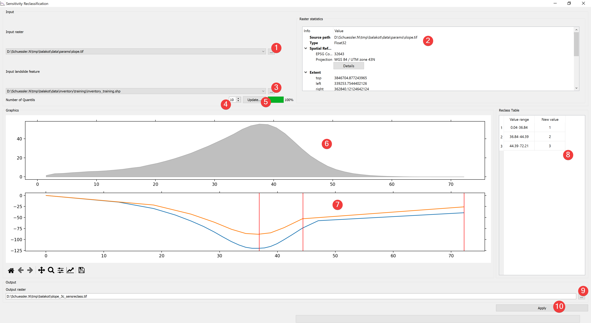

.. sensreclass:

Sensitivity Reclassification
----------------------------

   Sensitivity Reclassification Widget 

Use the cumulative variation of the contrast to reclassify a raster.

Usage
^^^^^

#. | Select the input raster. You can either select from imported rasters using the Input
   | raster combo box or select one from your PC (1).
#. | Select the input inventory. You can either select from imported features using the Input
   | feature combo box or select one from your PC (3).
#. Set the number of quantiles (4)
#. Update (5) the lower plot (7)
#. | Set the boundaries of the new values by right clicking in (7). If needed remove boundaries by 
   | double clicking them. Move boundaries by clicking on them and move the mouse while holding 
   | the mouse button.
#. | Select the output location of the reclassified raster. You can either type in the absolute 
   | file path yourself or pick one with a dialog (9).
#. Apply (10) your sensitivity reclassification to create the output raster.

You can run multiple analyses with varying number of quantiles with each analysis updating the 
lower plot (7).

The lower plot (7) and the reclass table (8) preview the output raster. The red lines in (7) 
indicate the boundaries of the new values. The upper plot (6) shows the distribution of the 
input rasters values. 

If you want to use the created raster in your LSAT Project you need to import it using the
:doc:`Import Raster Widget</DATA/Import/ImportRaster>`.

Information
^^^^^^^^^^^

The raster statistics (2) shows an embedded version of the
:doc:`Raster Info Widget</PROJECT/View/RasterInfo>`

If the input raster is of type float it will be displayed as a gray area. If it is an integer 
raster there will be bars in the upper plot (6) instead.

Sensitivity Reclassification uses :doc:`Weights of Evidence</ANALYSIS/Analysis/WofE>` to calculate 
the cumulative contrast for the lower plot.