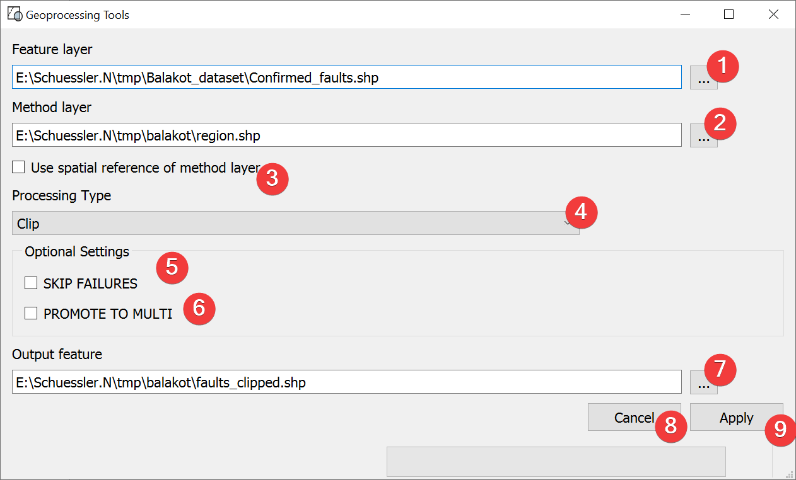

.. _geoprocessingtools:

Geoprocessing Tools
-------------------

   Geoprocessing Tools Widget

Process vector files.

Usage
^^^^^

#. | Select a feature layer. You can either type in the absolute file path yourself or pick one
   | with a dialog (1).
#. | Select a method layer. You can either type in the absolute file path yourself or pick one
   | with a dialog (2).
#. (Optional) Choose to create the output in the spatial reference of the method layer (3)
#. Pick the :ref:`processing type<processingtypes>` (4)
#. (Optional) Choose to proceed with the process if failures are encountered (5)
#. (Optional) Choose to promote to multi (6) (e.g. polygon -> multipolygon)
#. | Select the output file. You can either type in the absolute file path yourself or pick one
   | with a dialog (7).
#. Start the process (9)

\(2) Closes and resets the widget.

.. _processingtypes:

Processing Types
^^^^^^^^^^^^^^^^

*Clip*

	Returns parts of the feature layer that are inside the method layer.

*Erase*

	Returns parts of the feature layer that are outside the method layer.

*Intersect*

	Returns parts of the feature layer that are inside the method layer and adds attributes from
	the method layer.

*Symmetrical Difference*

	Returns parts of the feature layer and the method layer that do not overlap.

*Union*

	Returns all parts of the feature layer and the method layer with differing values if
	they overlap. If the features overlap they get both attributes.

Information
^^^^^^^^^^^

Geoprocessing Tools only supports Shapefiles (.shp) as of LSAT PMS v 1.0.0.

Input and Output
^^^^^^^^^^^^^^^^
+------------+---------------------------------------------------------------+
|  Input     | Feature layer (.shp)                                          |
|            |                                                               |
|            | Method layer (.shp)                                           |
+------------+---------------------------------------------------------------+
|  Output    | Processed Shapefile (.shp)                                    |
+------------+---------------------------------------------------------------+ 