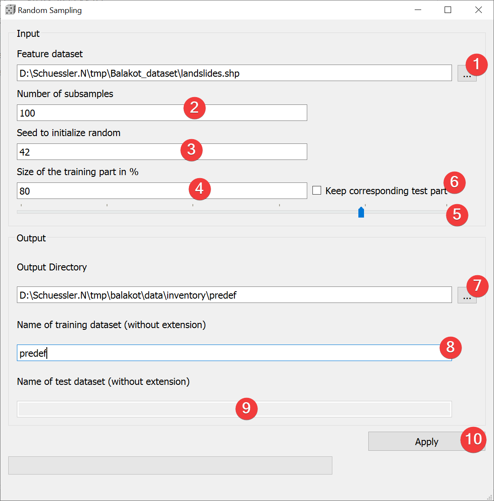

.. _randomsampling:

Random Sampling
---------------

   Random Sampling Widget

Create predefined subsamples.

Usage
^^^^^

#. | Pick a vector dataset to subsample. You can either type the absolute path to the file or 
   | select it from your PC (1).
#. Define the number of subsamples to create (2).
#. (Optional) Define a seed to initialize the random function (3).
#. (Optional) Decide to keep the corresponding test part (6).
#. | (Optional) Adjust the size of the training part either by typing the number (4) or adjusting 
   | the slider (5)
#. (Optional) Adjust the output location either by typing the output path or with a dialog (7).
#. (Optional) Name the training dataset(s) (8).
#. (Optional) Name the test dataset(s) (8) (Only if you save them).
#. Create the subsample(s) (10).

By defining a seed to initialize random (4) you can recreate the subsamples on a later date.

You can only name the test dataset if keep the corresponding part (6) and if the size of the 
training part (4) is < 100 %.

Sampling process
^^^^^^^^^^^^^^^^

LSAT only considers the total number of features when sampling the inventory into a training and 
test dataset.

Input and Output
^^^^^^^^^^^^^^^^
+------------+---------------------------------------------------------------+
|  Input     | Vector dataset                                                |
+------------+---------------------------------------------------------------+
|  Output    | Vector training dataset(s)                                    |
|            |                                                               |
|            | Naming scheme: /\*Name (8)\*_\*Nr. of subsample\*.\*ext\*     |
+            +                                                               +
|            | (Optional) Test vector dataset(s)                             |
|            |                                                               |
|            | Naming scheme: /\*Name (9)\*_\*Nr. of subsample\*.\*ext\*     |
+------------+---------------------------------------------------------------+ 