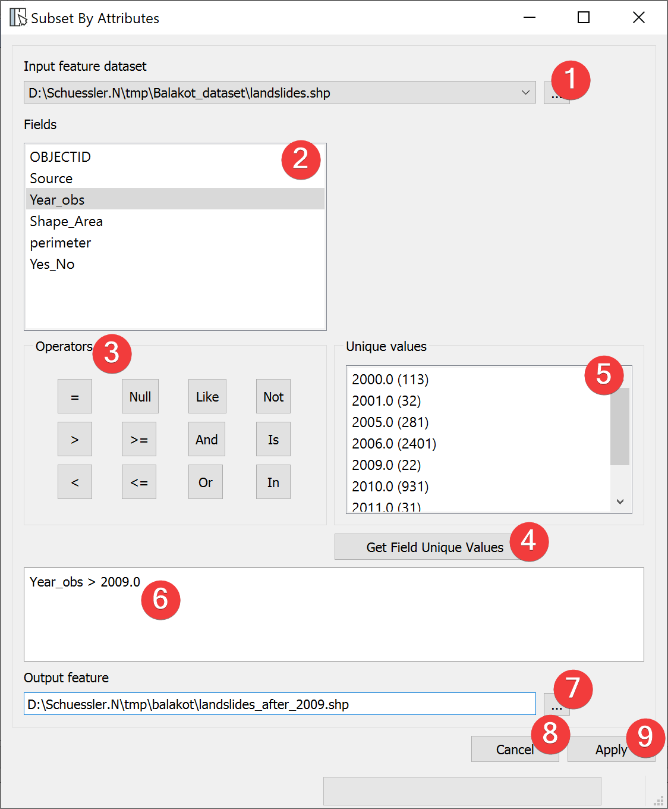

.. _subsetbyattributes:

Subset By Attributes
--------------------

   Subset By Attributes Widget

The Subset by Attributes Widgets subsamples vector files based on values in the feature attribute 
table.

Usage
^^^^^

#. Select an in input vector file with a dialog (1)
#. Formulate an equation in the field (6) that defines the subset you want. 
#. | Select the output vector location. You can either type in the absolute file path yourself 
   | or pick one with a dialog (7).
#. Start subsampling (9).

To get a Unique values list (5) of the selected Field (2) press get Field unique values (4).

You can double click Fields (2) and Unique values to copy them into (6). Operates can be copied 
over by clicking on them.

Clicking on Cancel (8) closes the widget.

Input and Output
^^^^^^^^^^^^^^^^
+------------+---------------------------------------------------------------+
|  Input     | Vector dataset                                                |
+------------+---------------------------------------------------------------+
|  Output    | Vector dataset                                                |
+------------+---------------------------------------------------------------+ 