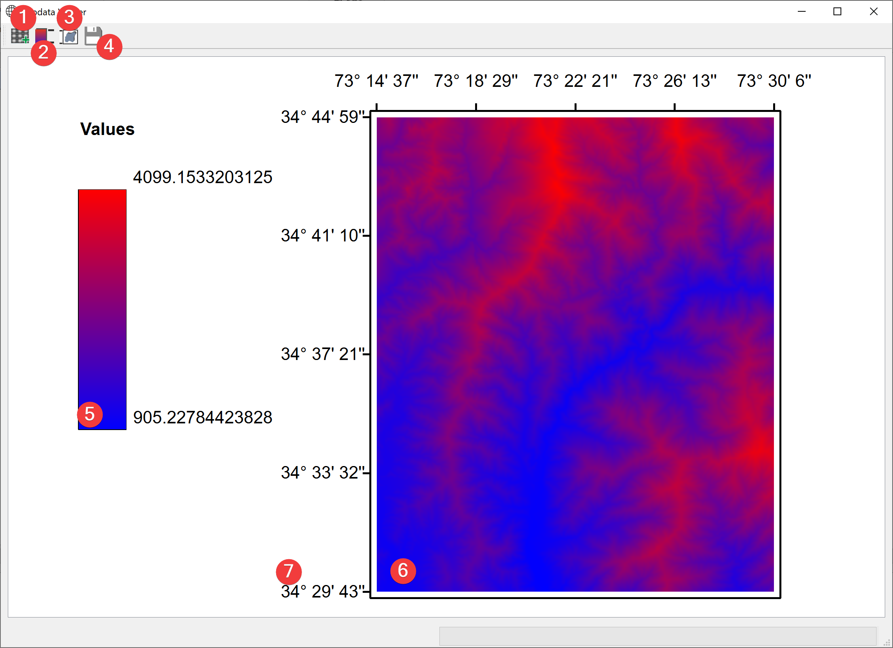

.. _geodataviewer:

Geodata Viewer
--------------

   Geodata Viewer Widget

View your projects raster datasets.

Overview
^^^^^^^^

* Click (1) to add raster datasets (6) to the view with a dialog
* Select a raster (6) in the scene and click (2) to show its legend (5)
* Add a bounding box (7) by selecting a raster (6) and clicking (3)
* Export the current view as a pic (.png) with a dialog (4)

Information
^^^^^^^^^^^

If you start the Widget from the :doc:`catalog</PROJECT/View/Catalog>` the selected raster will be 
available from the start.
This widget displayes coordinates in degrees (°), minutes (') and seconds ('') WGS84 (EPSG 
4326).