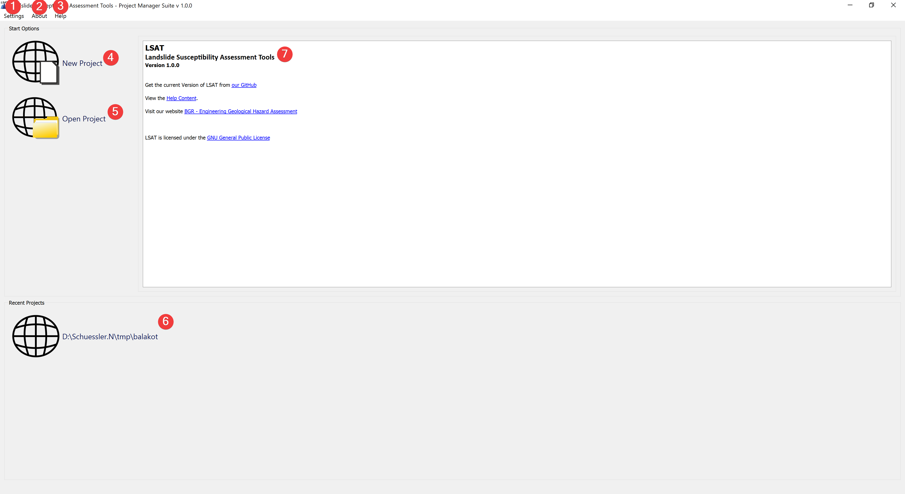

.. _startmenu:

First start and start menu
--------------------------

   LSAT Start Menu

The start menu appears when LSAT starts. You can quickly create new projects and open 
existing ones. Settings can be adjusted and the documentation opened.

Overview
^^^^^^^^

Settings (1) contains the :doc:`Language Settings</PROJECT/Settings/Language>`.

About (2) contains Information about LSAT.

Help (3) leads to the documentation.

New Project (4) opens the :doc:`New Project Widget</PROJECT/Project/NewProject>`.

Open Project (5) opens :doc:`a dialog to load an old project</PROJECT/Project/OpenProject>`.

Recent Projects (6) shows up to three of the most recent projects. Clicking on them instantly 
loads them into LSAT.

.. note:: To replace the default thumbnail with a custom one save an image as thumb.png in the 
    project root folder.

The information text (7) contains information where you can get the newest LSAT version, license 
information and ways to contact the developers.