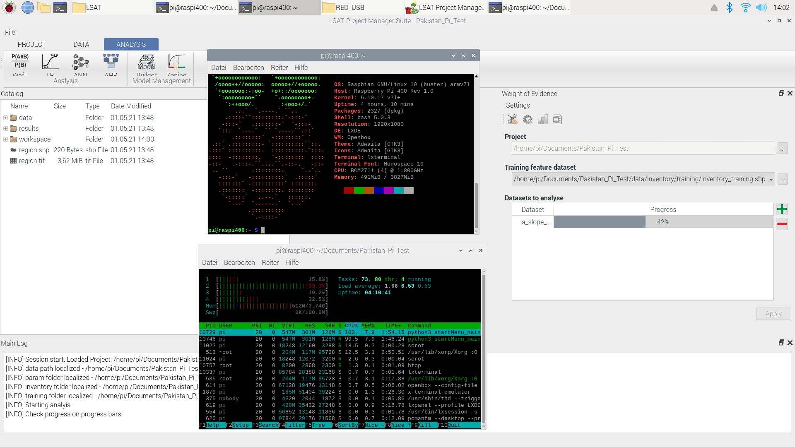

.. _systemrequirements:

System Requirements
-------------------

Suggested minimum system requirements:

+---------+----------------------------------+
| OS      | Windows 10, Linux (Ubuntu tested)|
+---------+----------------------------------+
| CPU     | > 2 GHz                          |
+---------+----------------------------------+
| RAM     | > 2 GB                           |
+---------+----------------------------------+

The exact requirements vary based on the Project you are working on.

   Development Version of LSAT running on a Raspberry Pi 400.

