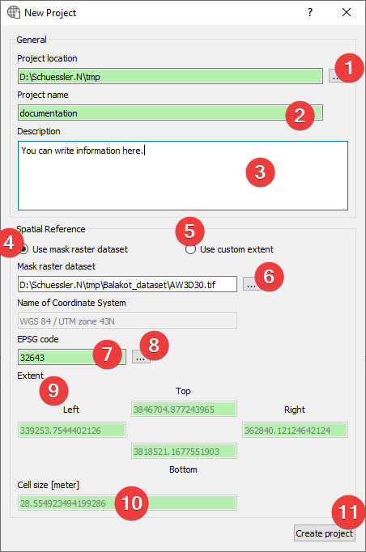
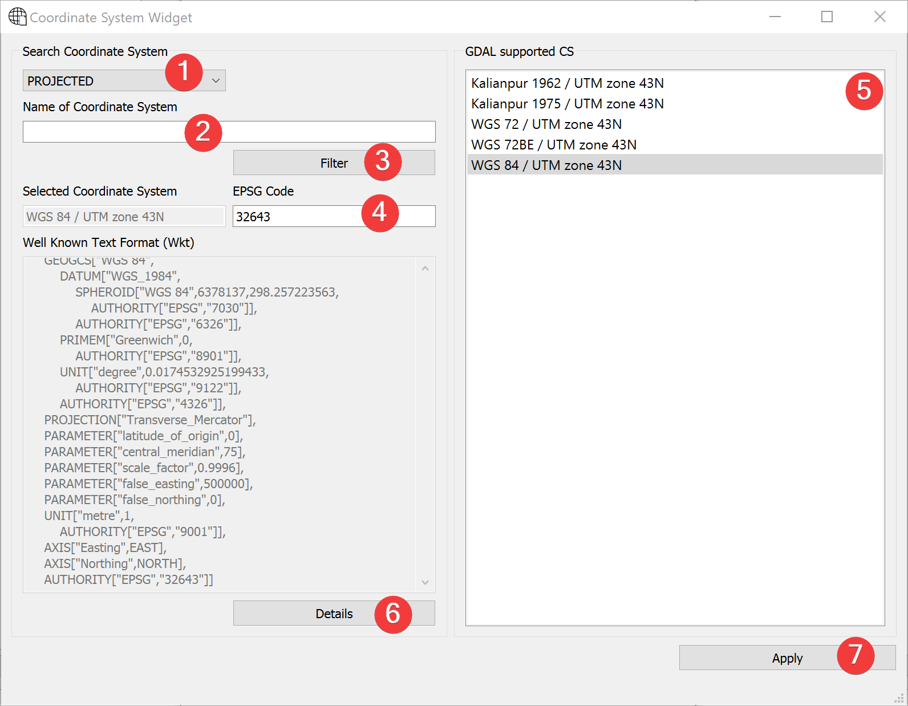
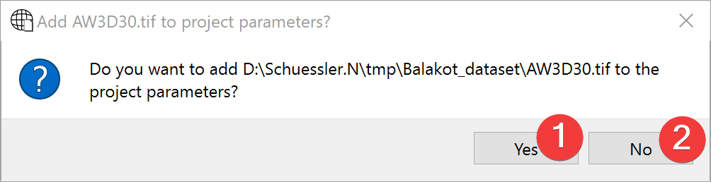

.. _newproject:

New Project
-----------

   New Project Widget

Widget to create new LSAT projects.

Usage
^^^^^

#. Specify the project location by picking a folder (1)
#. Name the project (2)
#. (Optional) Provide a description (3)
#. Provide spatial reference (2 Options):
    #. | Use a mask raster (4).
       | Specify a mask raster dataset (6). This will attempt to auto fill EPSG code (7), Extent 
       | (9) and cellsize (10)
    #. | Use a custom extent (5)
       | Fill EPSG code (6), Extent (9) and cellsize (10) by hand. Open the
       | :ref:`Coordinate System Widget<coordinatesystem>` (8) to help with the EPSG Code.
#. | Create a new project (11) (If you provided a mask you may
   | :ref:`import it into the new project<maskrasterimport>`)

To achieve the best results in later :doc:`analyses</ANALYSIS/ANALYSIS>` use a mask raster 
dataset. 

LSAT PM only supports mask raster datasets with square cells.

You can later change the project description with the 
:doc:`Project Info Widget</PROJECT/Project/ProjectInfo>`

Some raster datasets use underscores instead of spaces in the name of the coordinate system. If 
that is the case you can still use it as a mask but will have to provide the EPSG Code (7) by hand 
(8) using the :ref:`Coordinate System Widget<coordinatesystem>`.

.. _coordinatesystem:

Coordinate System Widget
^^^^^^^^^^^^^^^^^^^^^^^^

   Coordinate System Widget

With the coordinate system widget you can alter the EPSG code the project uses.

Usage

#. Use the combo box (1) to choose either projected or geographic coordinate systems.
#. Select the coordinate system (2 Options):
    #. Type the EPSG Code into (4) and press Enter.
    #. | Type the name of the coordinate system into (2) and press Enter or click (3) and then click
       | on the coordinate system in (5).
#. Click (7) to use the selected coordinate system.

Clicking on Details (6) will open `epsg.io <https://epsg.io>`_ with information about the 
coordinate system. If there is no EPSG Code (4) it will open `epsg.io itself <https://epsg.io>`_.

.. _maskrasterimport:

Mask raster dataset import
^^^^^^^^^^^^^^^^^^^^^^^^^^

   Mask raster dataset import dialog

Usage

#. Choose to import the mask (1) or don't (2).

If you import the mask raster dataset the :ref:`raster import dialog<importdialog>` opens, guiding 
you through the process.