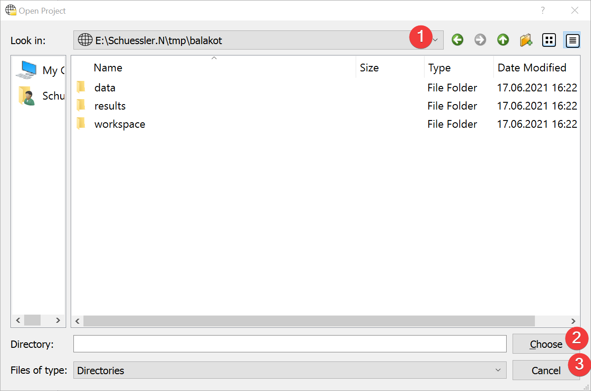

Open Project
============

   Open Project Widget

Dialog to open an existing LSAT Project.

Usage
^^^^^

#. Navigate to the project on your PC (1).
#. Select the project and choose it (2)

You can either select the Project folder in its parent directory and choose it (2) or open it and 
select (2) without selecting a subfolder.

You can cancel (3) the dialog at any point.

Information
^^^^^^^^^^^

LSAT highlights project folders in this dialog.

If you open the Dialog from an existing project you will start the dialog in that projects folder.
If you use it to open a project from the
:doc:`Start Menu</INTRODUCTION/GeneralInformation/StartMenu>` you will start at the LSAT folder.