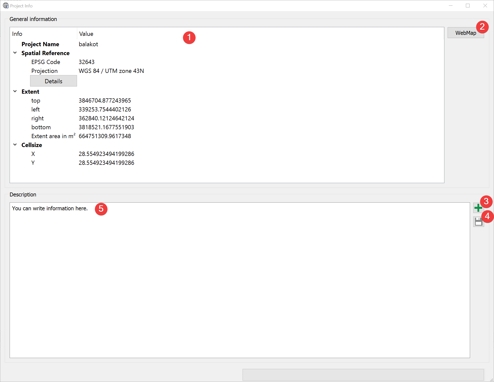
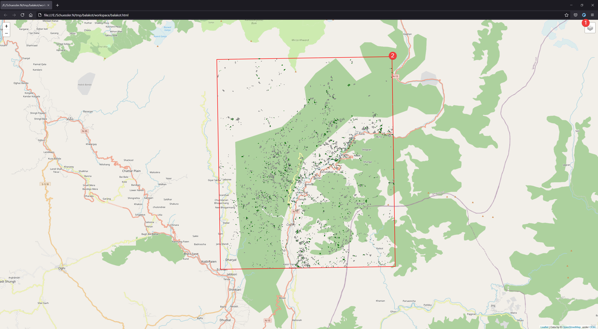

Project Info
------------

   Project Info Widget

Displays information and a user provided description of the project.

Usage
^^^^^

You can view spatial information about the project (1).

You can read and alter the provided description (5). Clicking on (3) opens a dialog to replace the 
Description with text from a .txt or .docx file. If you want to save changes to the description 
click (4).

You can open a WebMap (2) in your default browser:

   WebMap

The map shows the  projects borders (2) with `OpenStreetMap <https://www.openstreetmap.org>`_ as 
background. If you :doc:`imported an inventory</DATA/Import/ImportInventory>` these datasets will 
also be displayed. You can hide/show layers in the menu (1)

Information
^^^^^^^^^^^

The general information (1) shows a slightly modified and embedded version of the 
:doc:`Raster Info Widget</PROJECT/View/RasterInfo>` for the mask raster dataset (region.tif).

WebMap requires an internet connection to display the 
`OpenStreetMap <https://www.openstreetmap.org>`_ layer.

The WebMap is stored in /workspace/\*project name\*.html. It is independent of LSAT so it can be 
shared among peers and colleagues.