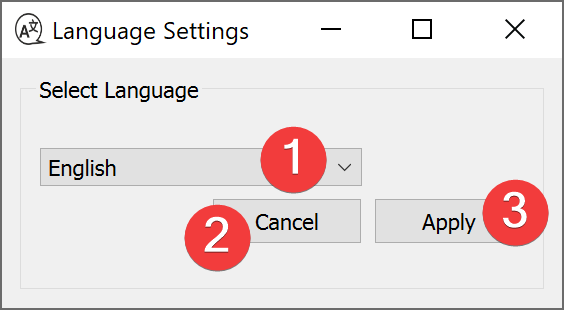

.. _language:

Language
--------

   Language Widget

The language widgets changes the language of the LSAT User Interface.

Usage
^^^^^

#. Select your preferred language in the combo box (1).
#. Click Apply (3).
#. Restart LSAT.

When you close the dialog with Cancel (2) the language won't change after a restart.

Information
^^^^^^^^^^^

The translations are stored in core/resources/qt_*language*.qm

They are created from .ts files in the same directory.

The initial language for LSAT is English. If LSAT can not translate a string it will fall back to 
the English version.