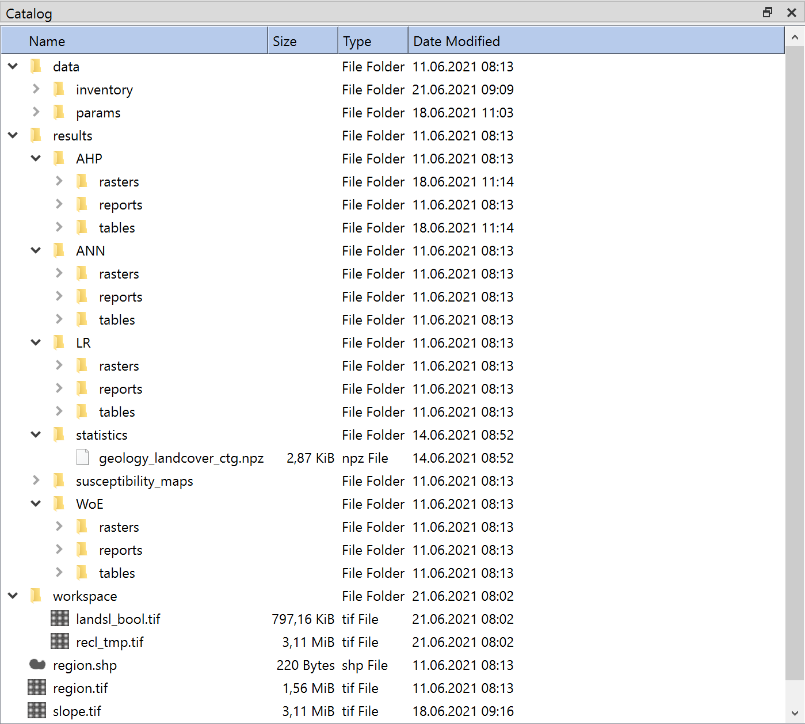

.. _catalog:

Catalog
-------

   Catalog Widget

View and work with your LSAT project and its files.

Overview
^^^^^^^^

The Catalog Widget displays the 
:ref:`folder and file structure of your selected LSAT Project<projectstructure>`.

**data**

Input data.

    **inventory**
    
    Input vector data.
    
        **test**
        
        Default path for :doc:`test part of the inventory</DATA/Import/ImportInventory>`
        
        
        **training**
        
        Default path for :doc:`training part of the inventory</DATA/Import/ImportInventory>`
    
    **params**
    
    Input :doc:`raster data</DATA/Import/ImportRaster>`

**results**

    **AHP**
    
        **rasters**
        
        Raster dataset output of the :doc:`AHP</ANALYSIS/Analysis/AHP>`
        
        **reports**
        
        Reports of the :doc:`AHP</ANALYSIS/Analysis/AHP>`
        
        **tables**
        
        Results of the :doc:`AHP</ANALYSIS/Analysis/AHP>`

    **ANN**
    
        **rasters**
        
        Raster dataset output of the :doc:`ANN analysis</ANALYSIS/Analysis/ANN>`
        
        **reports**
        
        Reports of the :doc:`ANN analysis</ANALYSIS/Analysis/ANN>` (coming soon)
        
        **tables**
        
        Results of the :doc:`ANN analysis</ANALYSIS/Analysis/ANN>`

    **LR**
    
        **rasters**
        
        Raster dataset output of the :doc:`LR analysis</ANALYSIS/Analysis/LR>`
        
        **reports**
        
        Reports of the :doc:`LR analysis</ANALYSIS/Analysis/LR>` (coming soon)
        
        **tables**
        
        Results of the :doc:`LR analysis</ANALYSIS/Analysis/LR>`

    **statistics**
        
    Results of the :doc:`contingency analysis widget</DATA/RasterTools/ContingencyAnalysis>`.

    **susceptibility_maps**
    
    Results of the :doc:`Model Builder</ANALYSIS/ModelManagment/ModelBuilder>` and 
    :doc:`Zoning Widget</ANALYSIS/ModelManagment/Zoning>`.

    **WoE**
    
        **rasters**
        
        Raster dataset output of the :doc:`WoE analysis</ANALYSIS/Analysis/WofE>`
        
        **reports**
        
        Reports of the :doc:`WoE analysis</ANALYSIS/Analysis/WofE>`
        
        **tables**
        
        Results of the :doc:`WoE analysis</ANALYSIS/Analysis/WofE>`

Right click on any folder to open it in your file manager.

The following table describes the options available by right clicking a file based on their type 
independent from their location:

+-----------+----------------------------------------------------------------------------------+
| File type | Available actions                                                                |
+===========+==================================================================================+
| Vector    | :doc:`Attribute Table</PROJECT/View/FAT>`                                        |
+           +                                                                                  +
|           | :doc:`Properties</PROJECT/View/FeatureInfo>`                                     |
+-----------+----------------------------------------------------------------------------------+
| Raster    | :doc:`Attribute Table</PROJECT/View/RAT>`                                        |
+           +                                                                                  +
|           | :doc:`View Data</DATA/Viewer/GeodataViewer>`                                     |
+           +                                                                                  +
|           | :doc:`Properties</PROJECT/View/RasterInfo>`                                      |
+-----------+----------------------------------------------------------------------------------+
| Docx      | Open Document - Opens the .docx in your default program for this file type       |
+-----------+----------------------------------------------------------------------------------+

In addition to the actions described above you can also delete all non essential files from the 
catalog. To do so right click and select delete or select the file/folder and press the 'delete' 
key.

.. _projectstructure:

LSAT Project structure
^^^^^^^^^^^^^^^^^^^^^^

Files and folders in a newly created LSAT Project with a mask raster: ::

    │   *project name*.log
    │   metadata.xml
    │   region.dbf
    │   region.prj
    │   region.shp
    │   region.shx
    │   region.tif
    │   region.tif.aux.xml
    │
    ├───data
    │   ├───inventory
    │   │   ├───test
    │   │   └───training
    │   └───params
    ├───results
    │   ├───AHP
    │   │   ├───rasters
    │   │   ├───reports
    │   │   └───tables
    │   ├───ANN
    │   │   ├───rasters
    │   │   ├───reports
    │   │   └───tables
    │   ├───LR
    │   │   ├───rasters
    │   │   ├───reports
    │   │   └───tables
    │   ├───statistics
    │   ├───susceptibility_maps
    │   └───WoE
    │       ├───rasters
    │       ├───reports
    │       └───tables
    └───workspace
