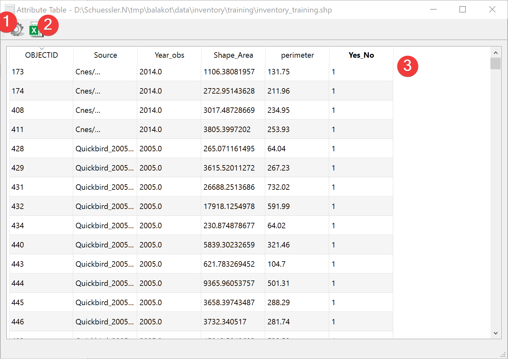

.. _featureattributetable:

Feature Attribute Table
-----------------------

   Feature Attribute Table Widget

Widget to display the Feature Attribute Table (FAT).

Overview
^^^^^^^^

Open the :doc:`Feature Info Widget</PROJECT/View/FeatureInfo>` by clicking on the gear (1).

Export the FAT (3) as an excel file (2).

Each Row in the FAT (3) represents a shape of the feature.
