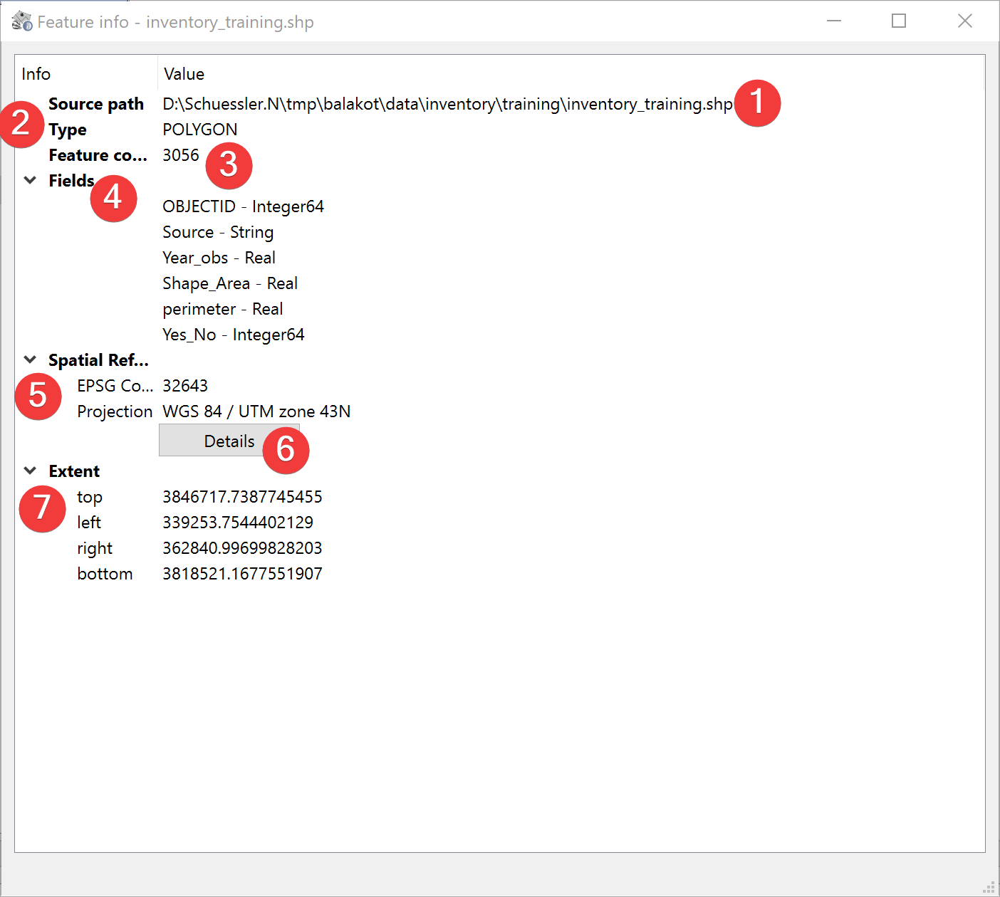

.. _featureInfo:

Feature Info
------------

   Feature Info Widget

Displays information about the selected vector file.

Overview
^^^^^^^^

The source path (1) is the absolute path to the feature you selected.

The type (2) is the type of geometry in the vector file (e.g. POINT, LINE, POLYGON etc.)

The feature count (3) is the amount of shapes in the file.

The fields (4) show the names of feature attributes their types. To view a detailed Feature 
Attribute Table (FAT) open the :doc:`FAT Widget</PROJECT/View/FAT>`

The spatial reference (5) shows the features projection and corresponding EPSG Code. Clicking on 
Details (6) will open `epsg.io <https://epsg.io>`_ with information about the coordinate system.

The extent (7) of the feature is displayed in units of the files spatial reference.
