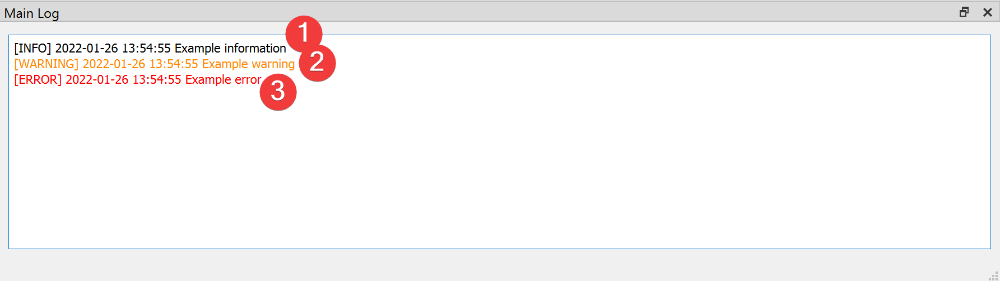

Main Log
--------

   Main Log Widget

Widget to inform you of events inside LSAT.

Information
^^^^^^^^^^^

There a three types of logging you will see in the Main Log:

#. [INFO] (1)

    The black text indicates normal behavior. Most LSAT widgets use the Main Log to inform the user 
    what they are doing, e.g. where they create a file or if they started an analysis.

#. [WARNING] (2)

    The orange text indicates that something is not optimal. An example for a warning would be that a 
    package used by LSAT will drop support for a feature LSAT uses. Please let us know if you think 
    the warning breaks or will break LSAT in the future.

#. [ERROR] (3)

    The red text indicates that something inside LSAT broke. If LSAT created an output file after an 
    error you should not use it, as it may contain corrupted data.
    If you see errors in you Log please file a bug report.

In addition to the Main Log each LSAT PM project contains a .log file with its full history of logging
outputs.