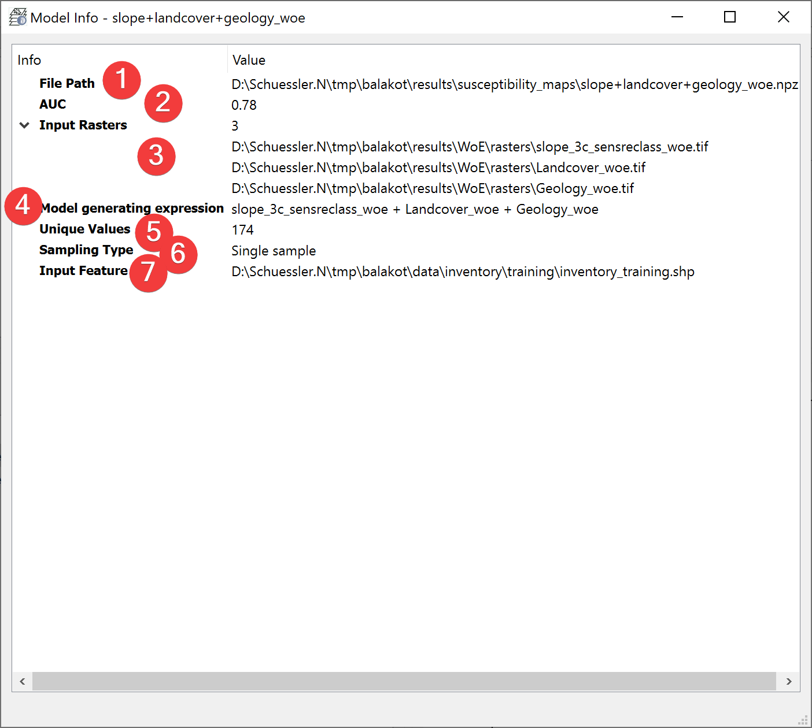

.. _modelInfo:

Model Info
------------

   Model Info Widget

Displays information about the selected model.

Overview
^^^^^^^^

The file path (1) is the absolute path to the model you selected.

AUC (Area under Curve) (2) indicates the quality of the model. Hover your mouse over the number to 
display all available digits.

\(3) shows the amount of input rasters and their absolute file path.

The model generating expression (4) shows in which way the datasets where combined to form the 
model.

\(5) shows the amount of unique values in the model.

The Sampling Type (6) shows how the input feature dataset (7) was used during the creation of the 
model. The models use either predefined subsamples, on the fly sampled samples or a single sample.