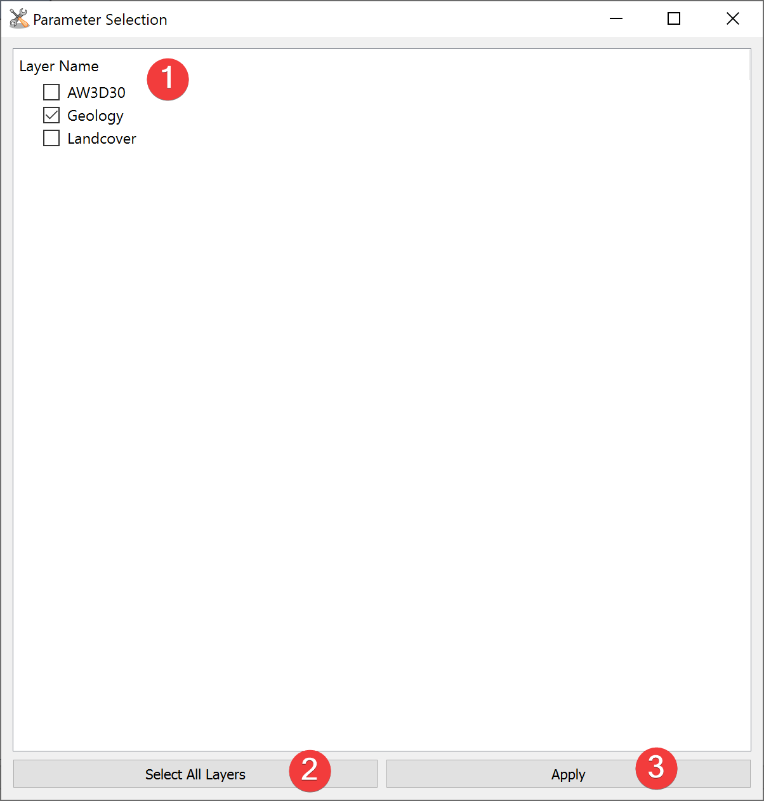

.. _parameterselection:

Parameter Selection
-------------------

   Parameter Selection Dialog

Select imported raster datasets for use in an :doc:`analysis</ANALYSIS/Analysis/Analysis>`.

Usage
^^^^^

#. | Check the raster datasets you want to use in the :doc:`analysis</ANALYSIS/Analysis/Analysis>`. 
   | You can select individual ones (1) or all imported ones (2).
#. Click apply (3) to start the analysis widget with the selected parameters preselected.

When you close the Parameter Selection Widget the selected Analysis will not start.

Information
^^^^^^^^^^^

After starting the Analysis Widget from the Paramter Selection you can still remove and add raster 
datasets.

Paramter Selection shows .tif files in data/params.