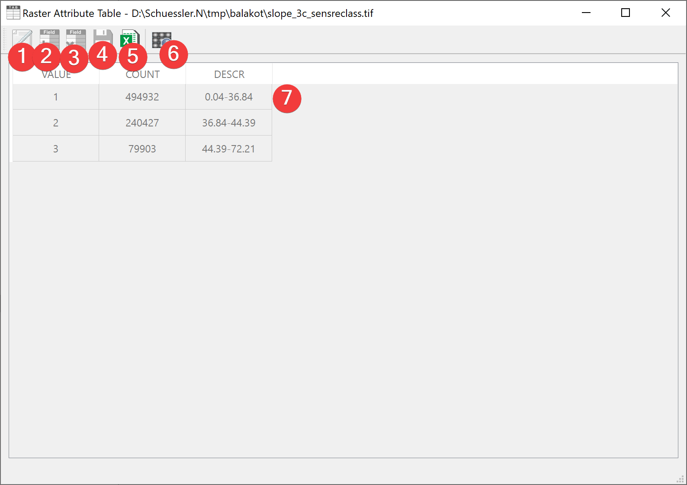
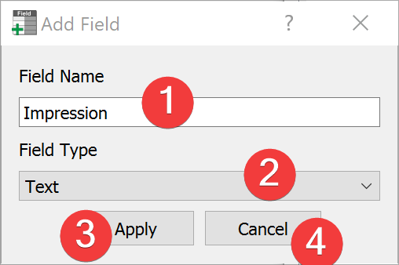

.. _rasterattributetable:

Raster Attribute Table
----------------------

   Raster Attribute Table Widget

Widget to display and modify the Raster Attribute Table (RAT).

Overview
^^^^^^^^

Clicking on the pen and paper (1) enables editing the RAT (7), adding new fields (2) and deleting 
existing ones (3).

To add a new field press the button (2) opening a :ref:`dialog<newfielddialog>`.

Delete a field by clicking the delete button (3). LSAT requires confirmation before deletion.

After modifying the RAT (7) save the changes made (4).

Export the RAT (7) as an excel file (5).

To open the raster in the :doc:`Raster Info Widget</PROJECT/View/RasterInfo>` click (6).

.. _newfielddialog:

New field dialog
^^^^^^^^^^^^^^^^

   New field dialog

Name the field (1), define its type (2) and confirm your choices (3) to add the new field to your 
RAT. You can cancel (4) the dialog at any time.

Information
^^^^^^^^^^^

After :doc:`importing a raster dataset</DATA/Import/ImportRaster>` LSAT will create a basic RAT 
for Non-float raster datasets with under 500 unique values if they don't have one.

Certain fields can not be modified or deleted (e.g. VALUE, COUNT).
