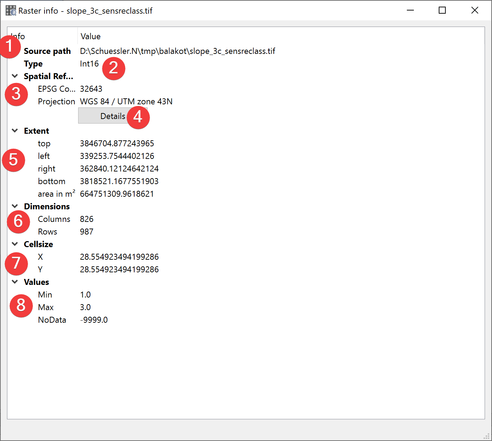

.. _rasterInfo:

Raster Info
-----------

   Raster Info Widget

Displays information about the selected raster dataset.

Usage
^^^^^

The source path (1) is the absolute path to the raster you selected.

The type (2) is the type of values stored in the raster (e.g. INT16, FLOAT32 etc.)

The spatial reference (3) shows the features projection and corresponding EPSG Code. Clicking on 
Details (4) will open `epsg.io <https://epsg.io>`_ with information about the coordinate system.

The extent (7) of the feature is displayed in units of the files spatial reference. Based on the 
cellsize (7) and dimensions (6) LSAT calculates the raster datasets area.

Values (8) shows the minimal and maximal values in addition to the NoData value of the raster 
dataset.
