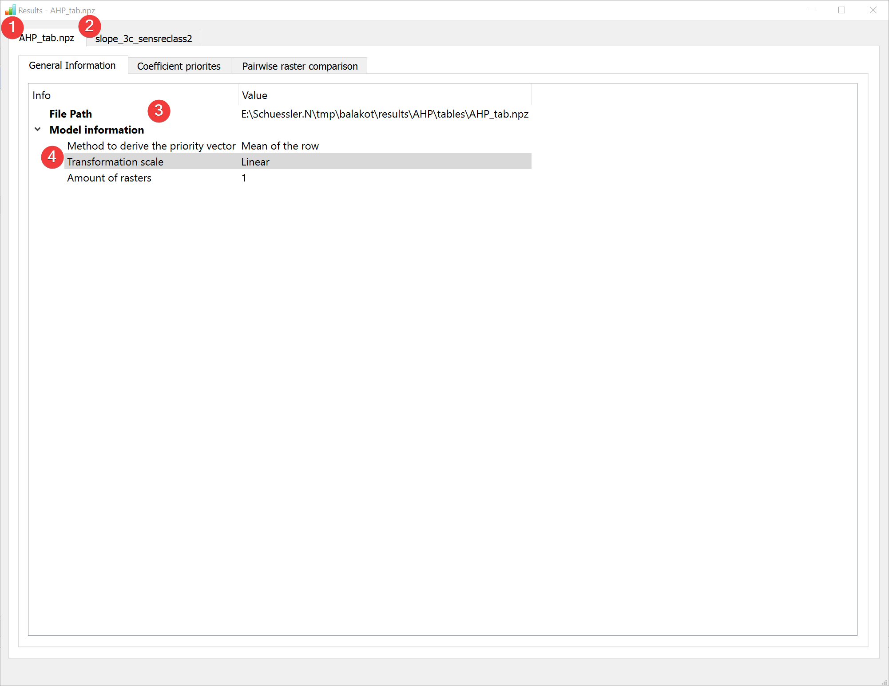
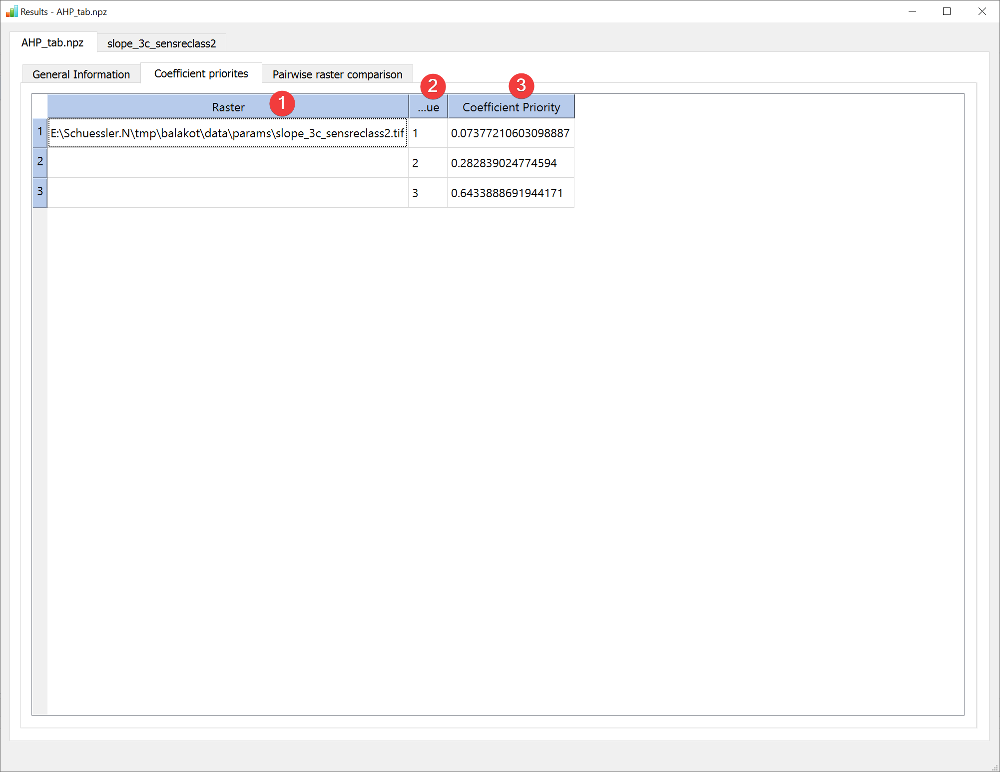
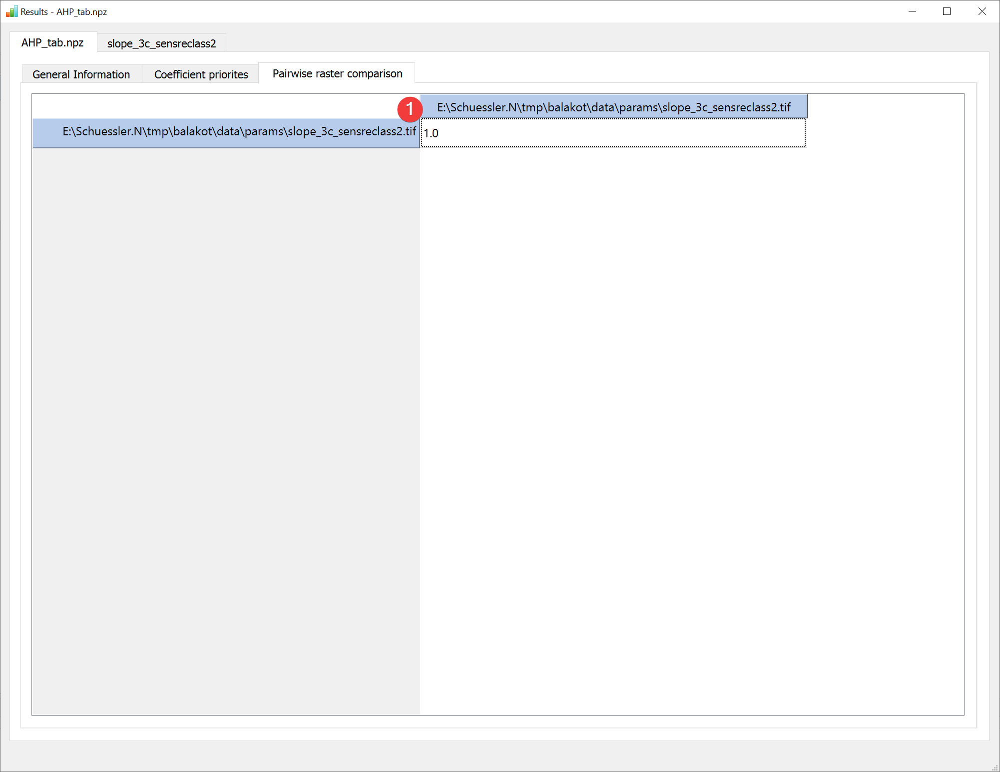
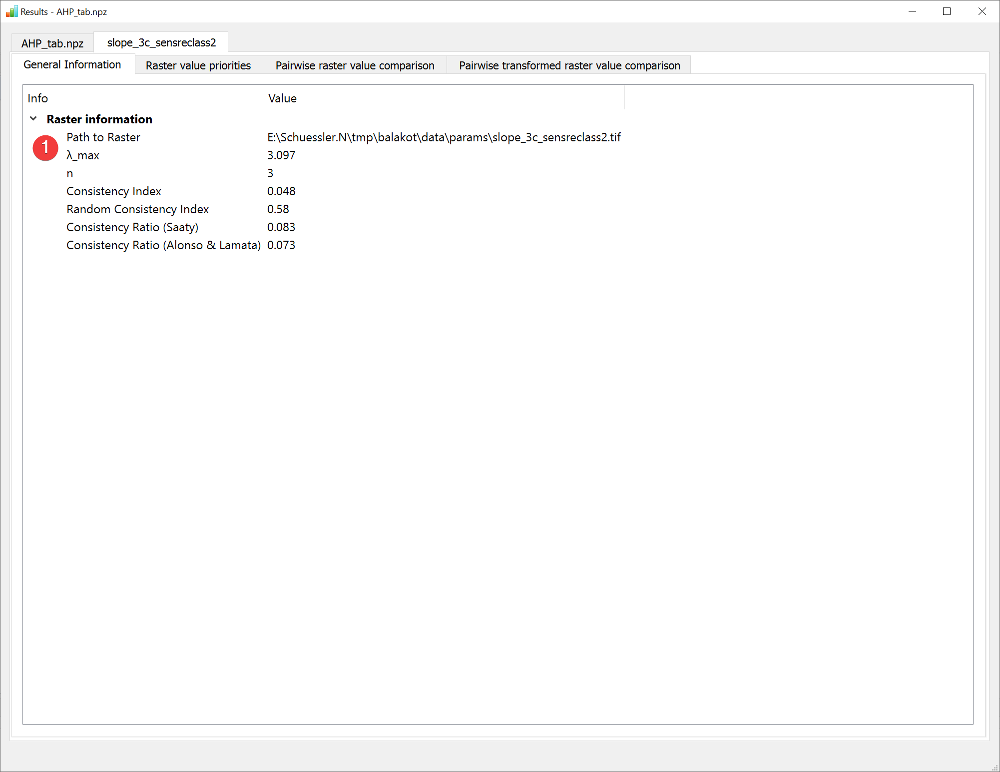
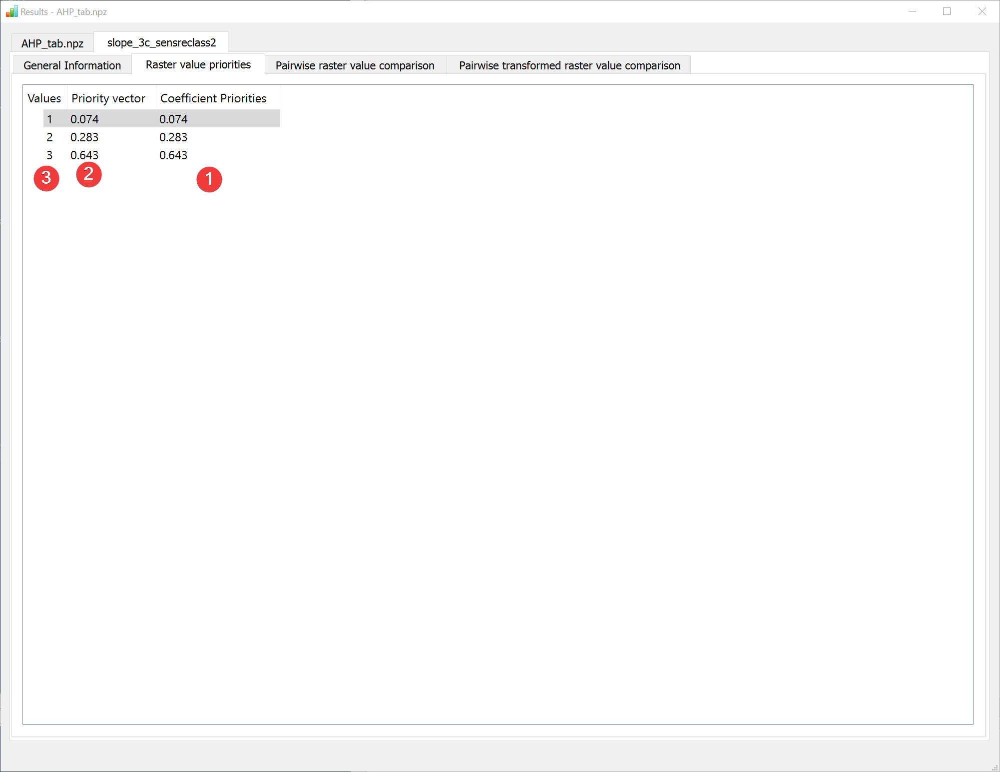
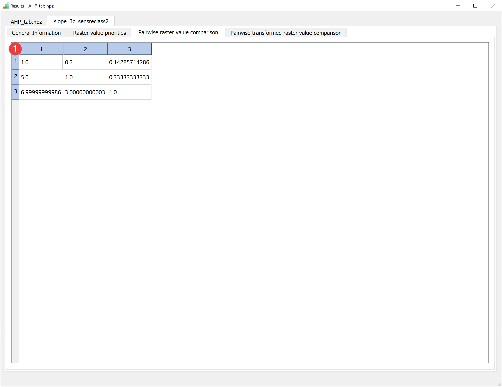
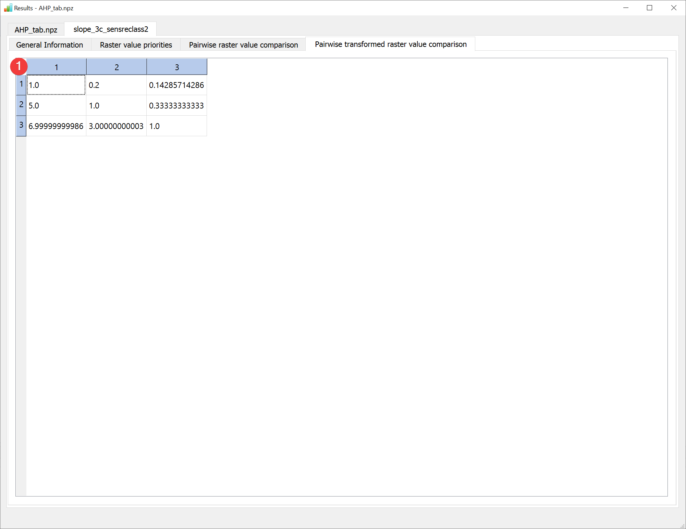

.. _resultsahp:

Results - AHP
-------------

   AHP Results Widget - general information raster comparison

Display the results of the :doc:`Analytic Hierarchy Process (AHP) analysis</ANALYSIS/Analysis/AHP>`.

Overview
^^^^^^^^

The result viewer shows a tab for the raster comparison (1) and for each raster dataset used in
the analysis (2).

The general information tab shows the path to the .npz containing the information (3) and basic 
information about the model (2).

   AHP Results Widget - coefficient priorities raster comparison

The coefficient priorities tab contains a table with each raster datasets path (1), its values (2) 
and the corresponding priorities (3).

   AHP Results Widget - pairwise raster comparison

The pairwise raster comparison tab contains the untransformed pairwise raster comparison table (1).

   AHP Results Widget - raster dataset general information

The general information tab shows information (1) unique to each raster. To see all available 
digits hover your mouse over the values.

   AHP Results Widget - raster value priorities

The raster value priorities tab shows a table of the raster values (1) its priority vectors in the 
dataset itself (2) and the coefficient priorities (3) when compared with other raster datasets. To
see all available digits hover your mouse over the values.

   AHP Results Widget - pairwise raster value comparison

The raster value comparison tab shows the raster value comparison table with as defined during the
analysis.

   AHP Results Widget - pairwise transformed raster value comparison

The raster value comparison tab shows the raster value comparison table modified by the user
defined scale. Because LSAT PMS supports only linear transformation at the moment the normal
pairwise raster value comparison is the same as the pairwise transformed raster value comparison.

Open this widget by right clicking the output .npz of an
:doc:`Analytic Hierarchy Process (AHP) analysis</ANALYSIS/Analysis/AHP>` in the
:doc:`catalog</PROJECT/View/Catalog>`.