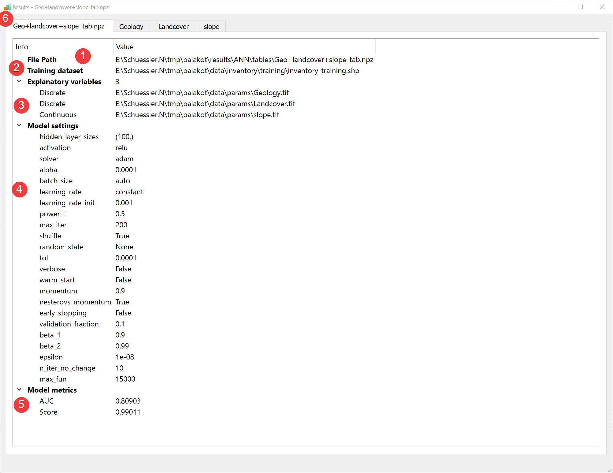
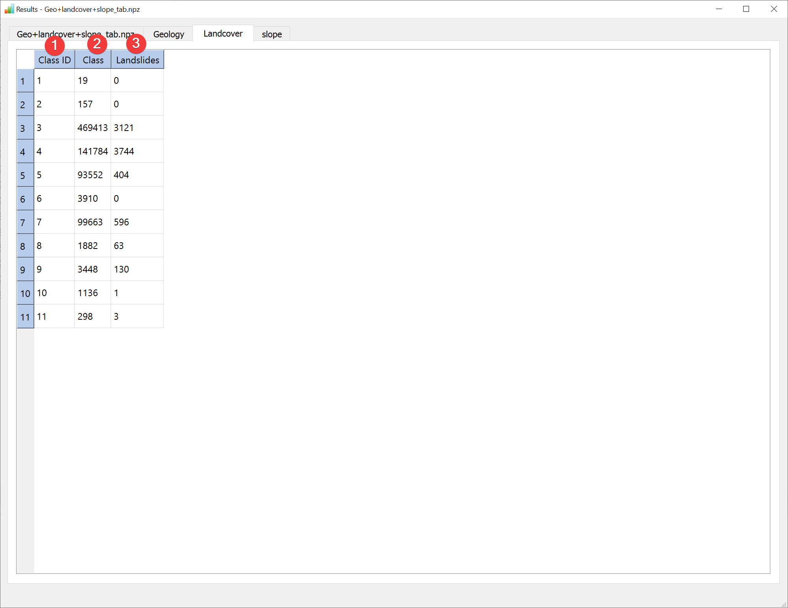
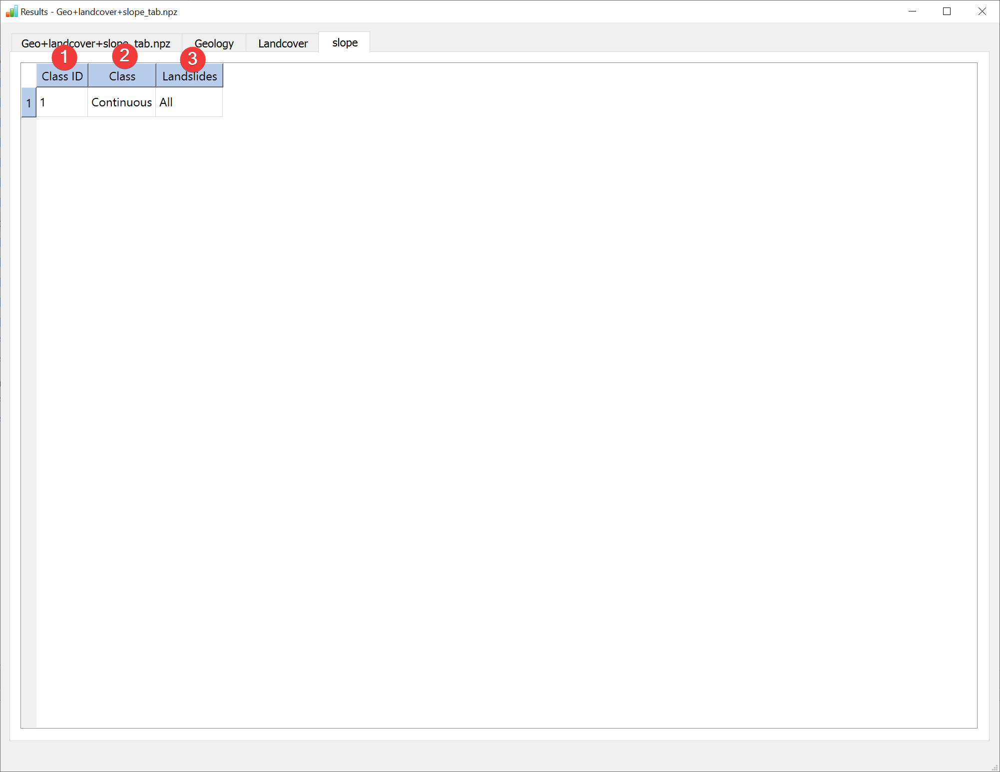

.. _resultsann:

Results - ANN
-------------

   ANN Results Widget - overview tab

Display the results of the :doc:`Artificial Neural Network (ANN) analysis</ANALYSIS/Analysis/ANN>`.

Overview
^^^^^^^^

* \(1) Shows the path to the results file.
* \(2) Shows the path to the used feature dataset.
* \(3) Shows the type and path to the used raster datasets.
* \(4) Shows the settings used when creating the model.
* \(5) Shows basic model metrics (hover your mouse over the results to show all available digits).

In addition to the overview tab (6) each raster dataset has its own tab:

   ANN Results Widget - raster dataset tab (discrete)

LSAT PM assigns a Class ID (1) for each unique value in the raster if it is a discrete type. Note
that these may differ from the original raster values.

Class (2) shows the amount of pixels in the raster dataset with that unique value / Class ID
Landslides (3) shows the amount of pixels in the raster dataset with that unique value / Class ID 
that also contain landslides.

Continuous type raster datasets will only have one Class ID:

   ANN Results Widget - raster dataset tab (continuous)

The information (1, 2, 3) is identical to the discrete raster datasets except there being only one
Class ID.

You can open this widget after finishing an :doc:`ANN analysis</ANALYSIS/Analysis/ANN>` or by 
right clicking the output .npz in the :doc:`catalog</PROJECT/View/Catalog>`.