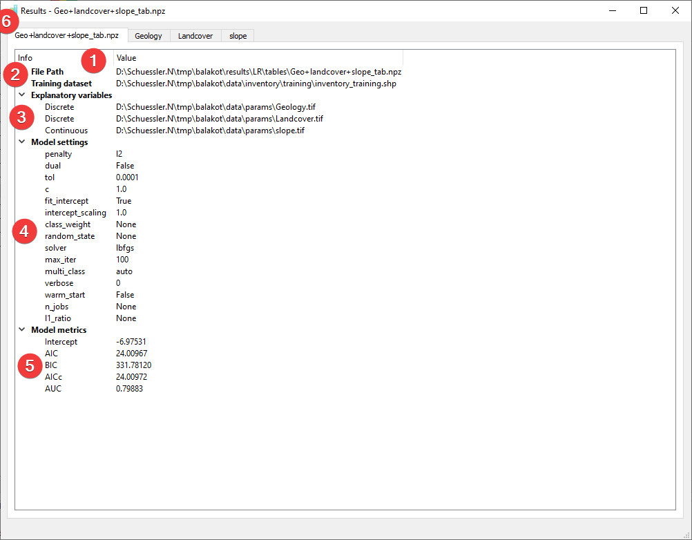

.. _resultslr:

Results - LR
-------------

   LR Results Widget - overview tab

Display the results of the :doc:`Logistic Regression (LR) analysis</ANALYSIS/Analysis/LR>`.

Overview
^^^^^^^^

* \(1) Shows the path to the results file.
* \(2) Shows the path to the used feature dataset.
* \(3) Shows the type and path to the used raster datasets.
* \(4) Shows the settings used when creating the model.
* \(5) Shows basic model metrics (hover your mouse over the results to show all available digits).

In addition to the overview tab (6) each raster dataset has its own tab:

   LR Results Widget - raster dataset tab (discrete)

The value (1) is the unique value in the raster if it is a discrete type.

Class pix (2) shows the amount of pixels in the raster dataset with that value.
Landslides pix (3) shows the amount of pixels in the raster dataset with that value
that also contain landslides.
Coef (4) is the calculated coefficient for that value.
The p-value (5) column contains the calculated p-value for that value.

Continuous type raster datasets will only have one value:

   LR Results Widget - raster dataset tab (continuous)

The information (1, 2, 3, 4, 5) is identical to the discrete raster datasets except there being only one
value displaying the range of values in the raster dataset.

You can open this widget after finishing an :doc:`LR analysis</ANALYSIS/Analysis/LR>` or by 
right clicking the output .npz in the :doc:`catalog</PROJECT/View/Catalog>`.