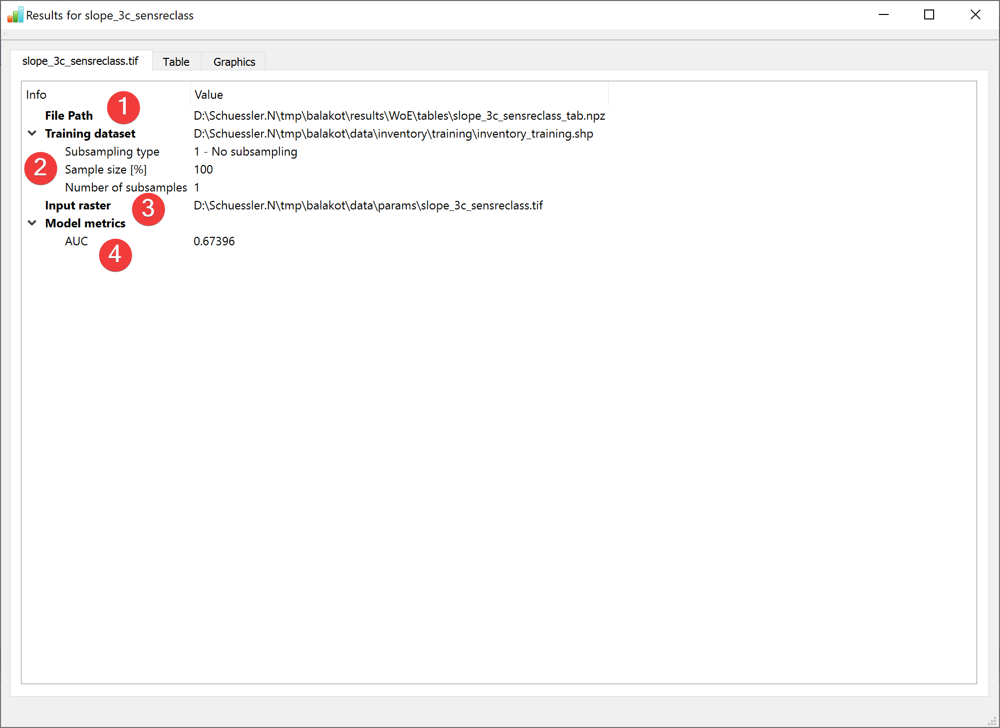
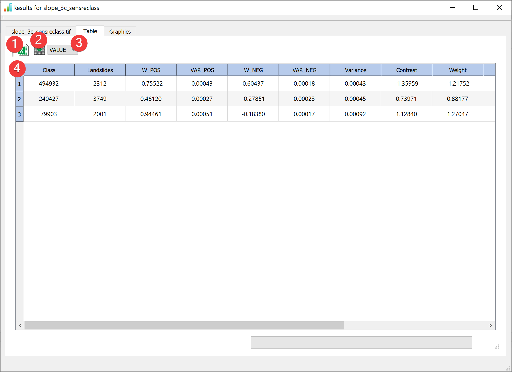
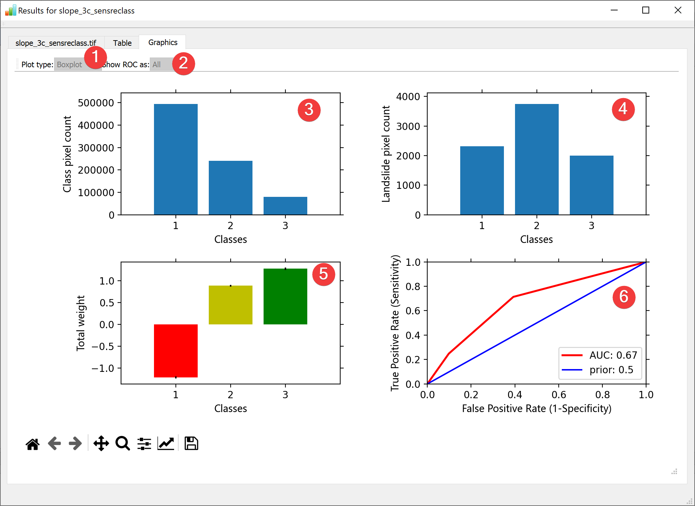

.. _resultswofe:

Results - WofE
--------------

   WofE Results Widget - overview tab

Display the results of the :doc:`Weight of Evidence (WofE) analysis</ANALYSIS/Analysis/WofE>`.

Overview
^^^^^^^^

* \(1) Shows the path to the results file.
* \(2) Shows the path to the used feature dataset and how it was subsampled.
* \(3) Shows the path to the used raster datasets.
* \(4) Shows basic model metrics (hover your mouse over the results to show all available digits).

The table contains all results of the calculation:

   WofE Results Widget - table tab

* \(1) Exports the table (4) as an excel file.
* \(2) Saves a raster with the column selected in the table (4) replacing the original raster
       values using a dialog.
* \(3) Selects an attribute from the raster attribute table to display on the far left column.

The Graphics tab shows selected results:

   WofE Results Widget - graphics tab

* \(1) Switches between Box-, and Violinplots for (4) and (5) (Only if multiple samples were used).
* \(2) Switches between all ROC curves or a range for (6) (Only if multiple samples were used).
* \(3) Shows the pixel count for each raster dataset value.
* \(4) Shows the landslide pixel count for each raster dataset value.
* \(5) Shows the total weight for each raster dataset value.
* \(6) Shows the ROC curve.

You can open this widget after finishing a :doc:`WofE analysis</ANALYSIS/Analysis/WofE>` or by 
right clicking the output .npz in the :doc:`catalog</PROJECT/View/Catalog>`.